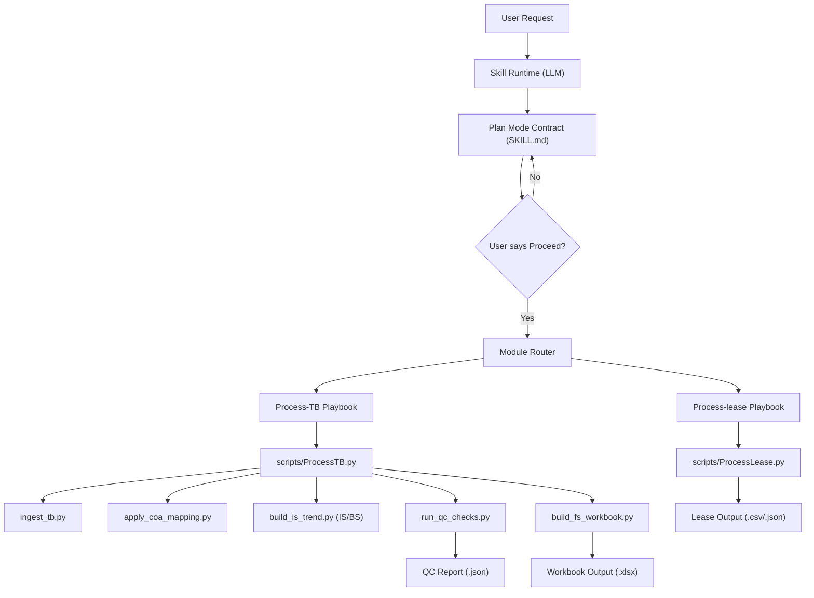
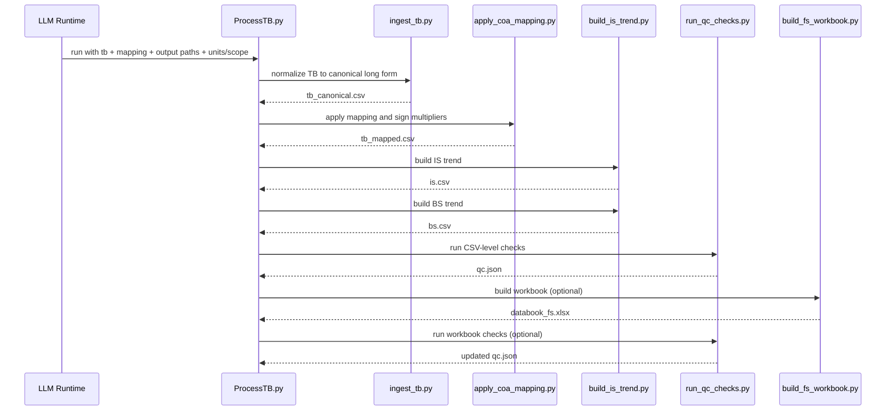

# Databook Analyst Skill

This README explains how the `databook-analyst` skill works end to end: request handling, execution routing, data contracts, workbook build behavior, and quality controls.

## 1) What This Skill Does

`databook-analyst` is a two-mode skill for financial diligence databook production:

1. `Plan Mode` (default): produce a complete execution plan, no workbook edits.
2. `Execute Mode` (gated): run only after explicit user confirmation (`Proceed`), then generate/update outputs.

The skill supports:

- `Process-TB`: trial balance normalization, mapping, IS/BS construction, workbook build, QC.
- `Process-lease`: lease extraction/normalization scaffold with exception reporting.
- Template update / QC refresh workflows via shared formatting and validation rules.

## 2) Core Operating Contract

Primary contract source: `SKILL.md`.

- Always start in Plan Mode.
- Require explicit `Proceed` gate before artifact generation.
- For `Process-TB`, `Control | Setup` is mandatory in outputs.
- Default units are `"$'000"` (`scale=0.001`); `"$mm"` is supported (`scale=0.000001`).
- Actual-value output (`"$"` / `scale >= 1`) is blocked unless explicitly allowed.

## 3) Skill Layout

```text
.agents/skills/db-analyst/
  SKILL.md                               # Orchestrator contract
  README.md                              # This guide
  assets/
    databook-template-v1.xlsx
    databook-template-v2.xlsx            # Active template baseline
    template-manifest.md
  references/
    README.md
    formatting-guidelines.md             # Formatting source of truth
    module-playbooks/
      Process-TB.md
      Process-lease.md
  scripts/
    README.md
    ProcessTB.py                         # End-to-end TB orchestration
    ProcessLease.py                      # Lease normalization scaffold
    ingest_tb.py
    apply_coa_mapping.py
    build_is_trend.py
    build_fs_workbook.py
    run_qc_checks.py
    tests/
      test_process_tb_pipeline.py
```

## 4) High-Level Architecture



## 5) Process-TB Data Pipeline

### 5.1 Pipeline Stages

1. Ingest TB (`ingest_tb.py`)
2. Apply COA mapping + sign policy (`apply_coa_mapping.py`)
3. Build statement trends (`build_is_trend.py`)
4. Run QC (`run_qc_checks.py`)
5. Build/prune workbook + write setup/QC sheets (`build_fs_workbook.py`)
6. Re-run workbook QC checks when workbook output is requested

### 5.2 ProcessTB Runner Flow



## 6) Data Contracts

### 6.1 Canonical TB Contract (`Data | TB`)

`ingest_tb.py` outputs:

- `period`
- `entity`
- `account_number`
- `account_name`
- `amount_raw`
- `units_scale_applied`
- `amount` (scaled)
- `source_column`
- `source_row`
- `is_derived`
- `notes`

### 6.2 Mapping Contract (`Map | COA to Lines`)

Expected mapping dimensions include:

- account identifier (`account_number` and/or `account_name`)
- `statement` (`IS` / `BS`)
- hierarchy keys/names (`Level1..Level3`)
- line target (`LineKey`, `LineName`)
- `SortOrder`
- `SignMultiplier` (optional; can be derived)

### 6.3 Mapped Output Contract

`apply_coa_mapping.py` emits:

- canonical TB fields + hierarchy fields
- `amount_signed`
- `mapping_status` (`mapped`, `unmapped`, `ambiguous`)
- `mapping_match_on`
- `sign_multiplier_status` (`provided`, `derived`, `missing_assumption`)
- `mapping_note`

## 7) Accounting and Formatting Policy

### 7.1 Sign Standardization

- IS: credits `+`, debits `-`
- BS: credits `-`, debits `+`
- Negatives displayed via parentheses format

When mapping sign multipliers are absent, the runner derives sign behavior and marks status.

### 7.2 Formatting Authority

Formatting source of truth: `references/formatting-guidelines.md`.

Important locked rules enforced by build + QC:

- Row 7 height = `19.5`
- Right-aligned numbers/dates/period headers
- Locked number/date formats
- No `IF(COUNT...)` / `IF(OR(...))` wrappers in rollup formulas
- BS summary uses period-end date headers (not `FY` text)
- No new conditional formatting rules
- Minimal-border total styling (thin black top border in numeric area)

## 8) Workbook Build Behavior

`build_fs_workbook.py`:

- Ensures required FS sheets exist.
- Optionally prunes workbook to FS-only scope:
  - `Control | Setup`
  - `Data | TB`
  - `Map | COA to Lines`
  - `Combined | IS`
  - `Combined | BS`
  - `Control | QC`
- Rebuilds `Data | TB` and `Map | COA to Lines`.
- Reconstructs `Combined | IS` and `Combined | BS` from mapped rows:
  - account-level rows
  - level subtotals
  - summary columns (IS yearly sums; BS as-at + yearly average blocks)
- Writes `Control | Setup` (source, units, scale, period end dates, fiscal labels).
- Writes QC details to `Control | QC` if report exists.

## 9) QC Framework

`run_qc_checks.py` evaluates:

- required column presence
- unmapped row ratio
- period raw tie-out
- units/scale consistency
- sign multiplier status
- account-to-statement uniqueness
- IS/BS statement coverage
- BS balance checks under sign convention
- derived-row inclusion behavior
- trend file schema/statement integrity
- workbook checks (sheet scope, formatting policies, formula policies, CF count)

Report output: JSON with `pass` / `warn` / `fail` and per-check details.

## 10) Process-lease Behavior

`ProcessLease.py` is a normalization scaffold:

- CSV input: normalize to canonical lease schema.
- PDF input: placeholder extraction row with `Extraction review` note.
- Optional exceptions report with missing critical field counts.

Lease schema:

- `lease_id`
- `entity`
- `start_date`
- `end_date`
- `payment`
- `currency`
- `notes`
- `source`

## 11) Local Execution Examples

Process-TB end-to-end:

```bash
python .agents/skills/db-analyst/scripts/ProcessTB.py \
  --tb chatgpt/db-analyst/mnt/data/financial-statement-databook-from-trial-balance.xlsx \
  --mapping .agents/skills/db-analyst/scripts/samples/coa_mapping_process_tb_sample.csv \
  --out-tb /tmp/tb.csv \
  --out-mapped /tmp/mapped.csv \
  --out-is /tmp/is.csv \
  --out-bs /tmp/bs.csv \
  --qc-report /tmp/qc.json \
  --out-workbook /tmp/databook_fs.xlsx \
  --scope fs-only
```

Run integration tests:

```bash
python -m unittest .agents/skills/db-analyst/scripts/tests/test_process_tb_pipeline.py
```

## 12) Extension Guidance

When adding a new module:

1. Add playbook under `references/module-playbooks/`.
2. Define locked input/output schema and tie-outs.
3. Add/update runner scripts for deterministic mechanics.
4. Integrate formatting rules via `formatting-guidelines.md`.
5. Extend QC checks where needed.
6. Add at least one pipeline test path under `scripts/tests/`.
7. Update `SKILL.md` routing + DoD and update this README.

## 13) Known Current Limits

- Mapping generation without user-provided mapping is governed by model logic and confidence notes, but deterministic auto-mapping heuristics are still limited.
- Lease PDF extraction is currently scaffold-level, not a full parser.
- Workbook builder is tuned to current FS-style outputs; additional module outputs may require layout abstraction.

## 14) Primary Source Files

Read these first for maintenance:

1. `SKILL.md`
2. `references/module-playbooks/Process-TB.md`
3. `references/formatting-guidelines.md`
4. `scripts/ProcessTB.py`
5. `scripts/build_fs_workbook.py`
6. `scripts/run_qc_checks.py`
