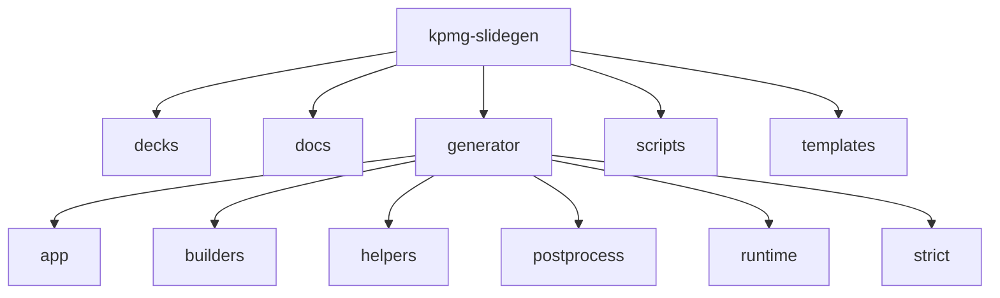
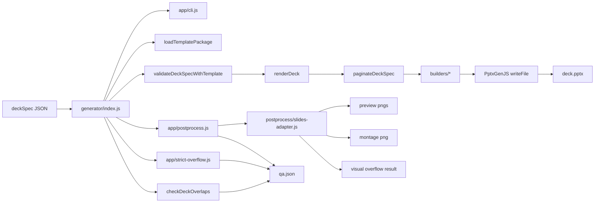
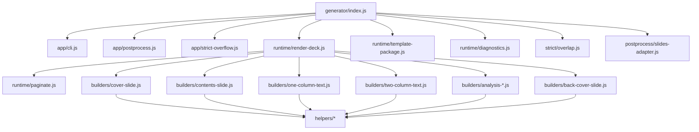
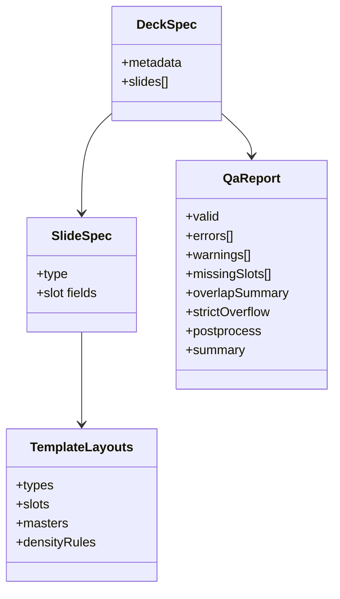

# Architecture

Canonical architecture map for how `deckSpec` input becomes `.pptx` plus QA output.

## 1) Repository Shape

## 2) Runtime Pipeline

## 3) Strict Overflow Design

- Strict overflow status is derived from visual overflow output only.
- No legacy fallback script path is used.
- If visual overflow cannot run, strict overflow is marked as skipped with reason.
- Strict failure is driven by either:
- severe overlap findings
- strict overflow status non-zero

## 4) Module Dependency View

## 5) Data Contracts

## 6) Rendering Guarantees

- Builders assume one production path per slide type.
- Cover/back-cover require template assets and throw explicit errors when missing.
- Pagination occurs before final render and may create continuation slides.
- Logical page numbers are applied only to footer-enabled masters.
- Title `maxChars` constraints for text slides are hard validation errors (no truncation fallback).
- Text slides keep `strapline` as its own top text box and support inline body subheaders (`{ text, subheader: true }`) in text arrays.
- Text bodies support `bodyStyle` = `bullets` or `paragraphs` where applicable.

## 7) Operational Notes

- Add new slide types by updating `templates/.../layouts.json` then dispatching in `generator/runtime/render-deck.js`.
- Keep QA schema additive; update consumers if non-additive changes are required.
- Keep template assets resolved via `template-package.js` manifest keys.
- Use `scripts/validate-visual.mjs` for end-to-end visual integration checks.
