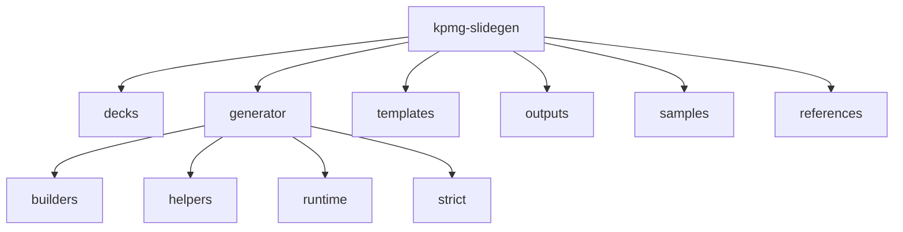
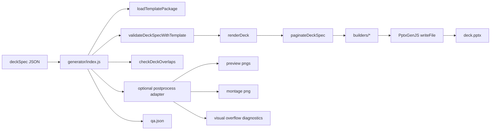
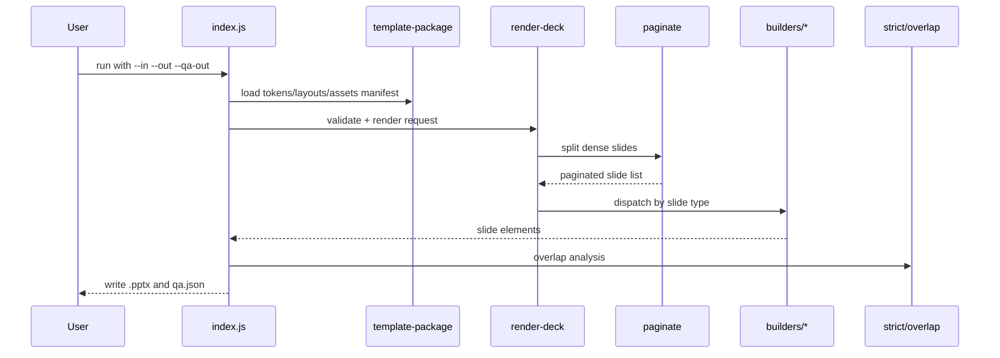
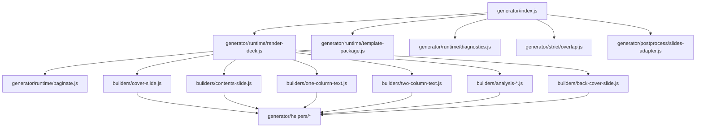
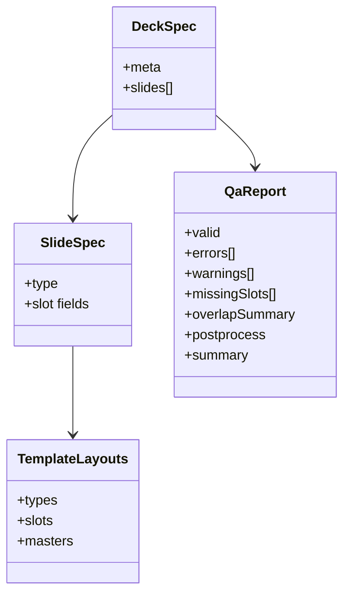

# Architecture

Minimal architecture map for how `deckSpec` input becomes `.pptx` + QA output.

## 1) Repository Shape

## 2) Runtime Pipeline

## 3) Render Sequence

## 4) Module Dependency View

## 5) Data Contracts

- `DeckSpec`: The full input JSON for one presentation run. It contains deck-level info and the ordered list of slides.
- `SlideSpec`: One slide definition inside `DeckSpec`. It tells the generator which slide `type` to render and provides that type's content fields.
- `TemplateLayouts`: The template rules loaded from `layouts.json` (what slide types exist, what slots are required, and where content should go).
- `QaReport`: The final JSON quality report produced after generation, including validation results, warnings, missing slots, and overlap checks.

## Operational Notes
- Add new slide types by updating `templates/.../layouts.json`, then mapping in `generator/runtime/render-deck.js`.
- Keep QA stable: if report shape changes, update consumers in lockstep.
- Keep template assets resolved through `template-package.js` rather than hardcoded paths.
