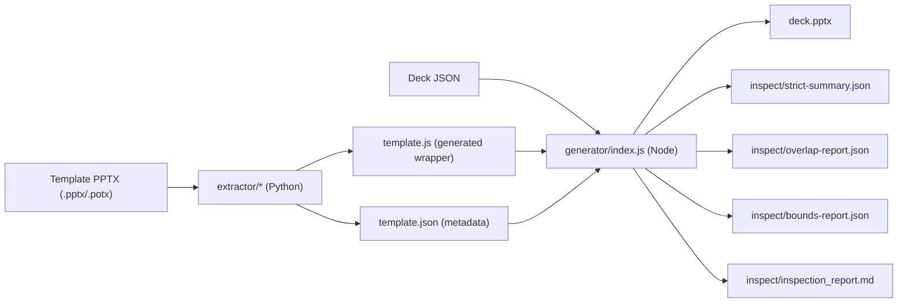

# kpmg-slidegen - Architecture

Last updated: 2026-02-05

This repository turns branded PowerPoint templates into repeatable JSON-to-PPTX generators.
The current production template runtime is `templates/kpmg-diligence`.

## 1) What This System Does

At a high level:

1. Parse a source template PPTX.
2. Generate a code-encoded wrapper (`template.js`) and metadata (`template.json`).
3. Feed a deck JSON spec into the runtime generator.
4. Emit a PPTX plus strict inspection artifacts (validation, overlap, bounds, diagnostics).

Key goals:

- Keep visual output aligned to template branding.
- Keep generation deterministic and scriptable.
- Catch layout regressions quickly with strict checks.

Non-goals:

- Editing PPTX XML directly during normal generation.
- Keeping generated PPTX outputs in git (except intentional baselines).

## 2) Top-Level Repository Map

```text
kpmg-slidegen/
  cli.py                         # Python CLI: extract/validate/generate entrypoints
  extractor/                     # PPTX parser + template codegen (Python stdlib-first)
  templates/
    kpmg-diligence/              # Active template project (runtime + samples + assets)
    kpmg-valuations/             # Source template artifacts only (no generator runtime yet)
  tests/                         # Python + Node smoke coverage
  dist/                          # Portable downstream bundles (ex: kpmg-gpt-inventory)
  docs/                          # Spec, plans, implementation notes
```

## 3) End-to-End Architecture



## 4) Runtime Flow (Deck Generation)

Main entrypoint:

- `templates/kpmg-diligence/generator/index.js`

Execution sequence:

1. Parse CLI args (`--in`, `--out`, optional `--no-strict`).
2. Validate deck with `generator/validate.js` + `template.validateSlideContent(...)`.
3. In strict mode, start diagnostics and pre-record missing required slots.
4. Build deck via `template.generateDeck(deckSpec)`.
5. Run strict analyzers:
   - overlap: `generator/strict/overlap.js`
   - bounds: `generator/strict/bounds.js`
6. Write PPTX to output path.
7. Write inspection artifacts with `generator/strict/report.js`.
8. Return failure exit when strict gate fails (severe overlaps, out-of-bounds, or invalid strict summary).

Important behavior:

- Strict mode is on by default.
- `--no-strict` still generates PPTX, but skips strict gating/artifacts.
- Pagination is applied before slide building (`paginateDeckSpec(...)` in `template.js`).

## 5) Extractor Architecture (Python)

The extractor package is intentionally modular.

### 5.1 Part and Relationship Graph

- `extractor/part_graph.py`
- Builds `PartGraph` from PPTX ZIP relationships:
  - slides
  - layouts
  - master
  - theme
  - media references
- Produces layout usage counts (`get_used_layouts`).

### 5.2 Theme and Token Resolution

- `extractor/resolvers.py`
- Resolves:
  - theme color scheme (`clrScheme`)
  - master color map (`clrMap`)
  - font scheme
- Includes color modifier support (`shade`, `tint`, `lumMod`, `lumOff`, `satMod`).

### 5.3 Element Extraction + Geometry

- `extractor/elements.py`
- Extracts element refs from slide/layout shape trees:
  - text, image, chart, table, generic shape/graphicFrame
- Handles grouped transforms via `extractor/geometry.py`.
- Captures placeholder metadata (`phType`, `phIdx`) for slot inference.

### 5.4 Slot and Layout Inference

- `extractor/slots.py`
- Maps layout names to slot families and detects slot inventories per layout.

- `extractor/layout_geometry.py`
- Heuristically infers geometry for common slots:
  - title/subtitle/strapline/body
  - chart/table/picture
  - 2-column and 4-column patterns

### 5.5 Code Generation

- `extractor/codegen.py`
- `build_template_json(...)` writes metadata contract.
- `build_template_js(...)` writes executable wrapper with:
  - `TOKENS`, `ASSETS`, `LAYOUTS`
  - validation function
  - master definitions
  - slide-type builder dispatch
  - `generateDeck(...)`

### 5.6 Extraction CLI

- `cli.py extract`
- Calls `write_template_files(TemplateConfig(...))`.
- Overwrites generated files in the template directory.

Important extractor prerequisite:

- `write_template_files(...)` expects pre-existing:
  - `assets/assets-base64.json`
  - `assets/gradient_data_uris.json`
- It validates that required embedded assets are valid data URIs.

## 6) Generated Template Contract (`template.js` / `template.json`)

### `template.js` exports

- `TOKENS`
- `ASSETS`
- `LAYOUTS`
- `DETECTED_LAYOUT_SLOTS`
- `DETECTED_LAYOUT_GEOMETRY`
- `validateSlideContent(type, content)`
- `generateDeck(deckSpec)`

`generateDeck(...)` responsibilities:

- Define wide layout (13.333 x 7.5).
- Set metadata and theme fonts.
- Define masters:
  - `KPMG_WHITE`
  - `KPMG_COVER`
  - `KPMG_SECTION`
  - `KPMG_CLOSING`
- Paginate input deck.
- Dispatch to slide builders by `slide.type`.
- Attach notes when provided.

### `template.json` responsibilities

Metadata snapshot used for inspection/debugging and codegen context:

- schema/version/timestamp/source
- slide dimensions
- color and font maps
- used layout frequencies
- asset source pointers
- detected layout slot summary
- inferred layout geometry

## 7) Template Runtime Architecture (`templates/kpmg-diligence`)

### 7.1 Builder Dispatch

Slide type -> builder mapping is defined in generated `template.js`.

Supported runtime slide types:

- `cover`
- `divider`
- `twoColumnText`
- `analysis2ColumnsText`
- `oneColumnText`
- `analysisNarrowTable`
- `analysisWideChart2ColsText`
- `analysisWideChartTableText`
- `summaryFinancials`
- `titleStrapline4TextBoxes`
- `backCover`

### 7.2 Builder Layer

Files: `generator/builders/*.js`

Responsibilities:

- Build content using PptxGenJS primitives.
- Apply geometry from `LAYOUTS` when credible.
- Fall back to hardened defaults when extracted geometry is unreliable.
- Keep footer-safe bottom bounds on `KPMG_WHITE` slides.

Notable fallback instrumentation:

- `recordFallback(...)` is emitted in layouts where extracted geometry may be invalid
  (ex: some multi-column cases).

### 7.3 Shared Helper Layer

Files: `generator/helpers/*.js`

Highlights:

- `bullets.js`: structured bullet runs, heading lines, nested bullets.
- `media.js`: dimension probing + crop/contain sizing for common image formats.
- `text.js`: text sanitization and text box utilities.
- `title.js`: shared title rendering.
- `geometry.js`: geometry credibility checks and clamping.
- `chart.js`: contrast-aware chart label color helper.

### 7.4 Pagination Layer

File: `generator/runtime/paginate.js`

Purpose:

- Prevent text overlap by splitting long content into continuation slides.

Current pagination coverage:

- `twoColumnText`, `analysis2ColumnsText`
- `oneColumnText`
- `analysisWideChart2ColsText`, `analysisWideChartTableText`
- `analysisNarrowTable` (table row chunking)

Approach:

- Heuristic line estimation (box width/height + font size).
- Conservative chunking to avoid overflow.
- Title continuation suffix: `(cont.)`.
- Footer-safe height adjustment.

## 8) Strict Inspection and Diagnostics

### 8.1 Strict overlap

- File: `generator/strict/overlap.js`
- Compares slide object bounds pairwise.
- Classifies overlap severity:
  - severe for meaningful text overlaps
  - warning for other overlap cases
- Includes guardrails to reduce line/shape false positives.

### 8.2 Strict bounds

- File: `generator/strict/bounds.js`
- Flags any object extending outside slide dimensions.
- Converts EMU-like values where needed.

### 8.3 Inspection artifact writer

- File: `generator/strict/report.js`
- Writes:
  - `strict-summary.json`
  - `inspection_report.md`
  - plus overlap/bounds JSON when available

### 8.4 Diagnostics collector

- File: `generator/runtime/diagnostics.js`
- Captures:
  - warnings
  - missing required slots
  - layout fallbacks
  - overlap summary snapshot

## 9) Deck Spec Contract (Practical)

Top-level:

- `metadata` (optional)
- `slides[]` (required)

Per slide:

- `type` (required)
- additional fields by layout slot contract

Required fields by type (from `LAYOUTS` in generated template):

- `cover`: `title`, `subtitle`
- `divider`: `sectionNumber` (2-digit pattern), `sectionTitle`
- `twoColumnText`: `title`, `leftBody`, `rightBody`
- `analysis2ColumnsText`: `title`, `leftBody`, `rightBody`
- `oneColumnText`: `title`, `body`
- `analysisNarrowTable`: `title`, `table`
- `analysisWideChart2ColsText`: `title`, `body`, `chart`
- `analysisWideChartTableText`: `title`, `body`, `chart`
- `summaryFinancials`: `title`, `kpis`
- `titleStrapline4TextBoxes`: `title`, `columns`
- `backCover`: no required fields

Validation behavior:

- Fails on missing required/pattern violations.
- Emits warnings for maxLength overflow and chart-placeholder mismatches.

## 10) Multi-Template Strategy

The repository is template-oriented:

- Each template should own:
  - source PPTX
  - generated `template.js` / `template.json`
  - local `generator/` runtime
  - `samples/`, `assets/`, `references/`, `outputs/`

Current status:

- `templates/kpmg-diligence`: fully operational template runtime.
- `templates/kpmg-valuations`: source POTX/XLSX assets only (no runtime yet).

## 11) Dist Bundle Architecture (`dist/kpmg-gpt-inventory`)

This is a portable packaged workflow that vendors a runtime copy:

- deck source: `dist/kpmg-gpt-inventory/deck/*.json`
- vendored runtime: `dist/kpmg-gpt-inventory/runtime/kpmg-diligence/`
- automation scripts:
  - `scripts/add_gpt.py`
  - `scripts/build_inventory_deck.py`

Build script flow:

1. Ensure Node deps in vendored runtime.
2. Validate deck JSON.
3. Generate PPTX via vendored generator.
4. Emit strict inspection report for the run folder.

## 12) Testing Strategy

Run:

- `python3 -m unittest discover -s tests -p 'test_*.py'`

Coverage map:

- extractor foundations:
  - part graph
  - geometry conversion
  - layout slot detection
  - layout geometry inference
  - gradients and renderer
- codegen smoke:
  - `write_template_files(...)` output contract
- runtime e2e (conditional on Node + deps):
  - validate + generate demo deck
- Node smoke:
  - synth deck across all `LAYOUTS` with required slots

## 13) Known Boundaries and Gotchas

1. Generated file boundary:
- Do not hand-edit `template.js` or `template.json`.
- Edit extractor logic/builders and regenerate.

2. Token duality:
- `template.js` includes generated `TOKENS`.
- Builder typography defaults live in `generator/tokens.js`.
- Keep both aligned when tuning visual system behavior.

3. Geometry is heuristic:
- Extracted layout geometry is best-effort.
- Builders intentionally keep fallback geometry paths.

4. Strict checks are geometric, not semantic design QA:
- They catch collisions/out-of-bounds.
- They do not guarantee "looks perfect" parity with a human baseline review.

5. Asset data-URI dependency:
- Extraction/codegen requires prebuilt base64 asset JSON files.

## 14) Operational Runbook

Regenerate wrapper:

```bash
cd templates/kpmg-diligence
npm run template:generate
```

Validate sample:

```bash
cd templates/kpmg-diligence
node generator/validate.js --in samples/demo.json
```

Generate with strict checks:

```bash
cd templates/kpmg-diligence
RUN_ID=$(date +%Y-%m-%d_%H%M%S)
OUT_DIR=outputs/runs/$RUN_ID/demo
mkdir -p "$OUT_DIR"
node generator/index.js --in samples/demo.json --out "$OUT_DIR/deck.pptx"
```

Generate without strict checks:

```bash
cd templates/kpmg-diligence
node generator/index.js --in samples/demo.json --out outputs/runs/manual/demo/deck.pptx --no-strict
```

## 15) Where to Extend Safely

Add a new slide type:

1. Add layout contract in extractor codegen (`extractor/codegen.py`).
2. Implement builder in `generator/builders/`.
3. Wire builder into generated wrapper dispatch.
4. Add sample JSON and smoke coverage.

Add a new template:

1. Create `templates/<new-template>/` with source PPTX + assets.
2. Run extraction/codegen to produce `template.js` and `template.json`.
3. Add/adjust template-local `generator/`.
4. Add sample decks + tests.
5. Document template-specific constraints in template-local docs.
