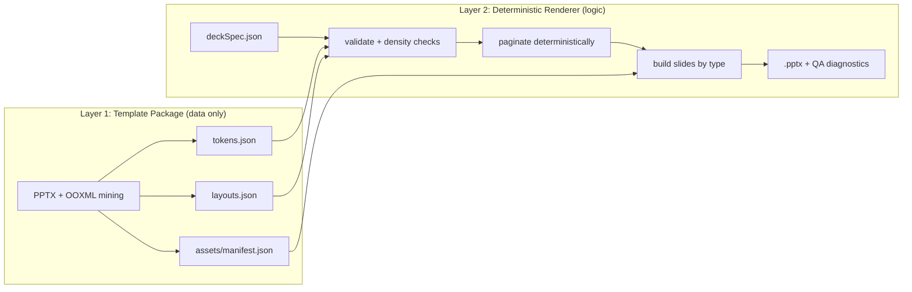
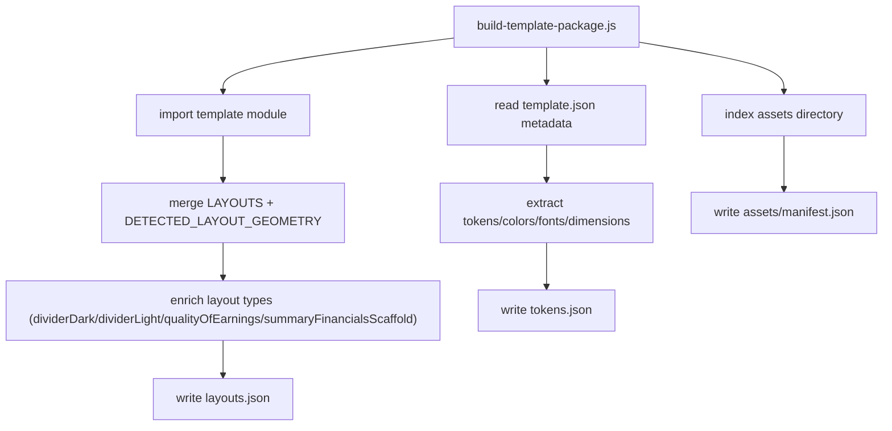
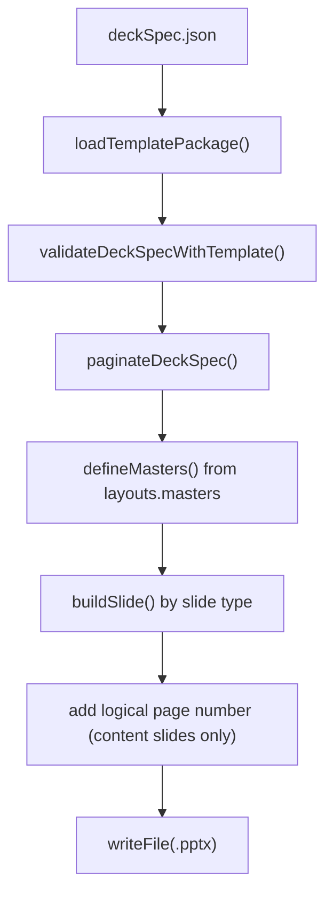
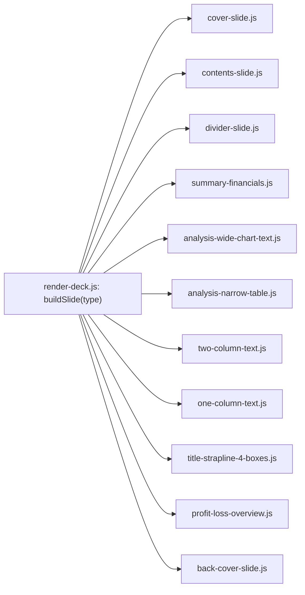
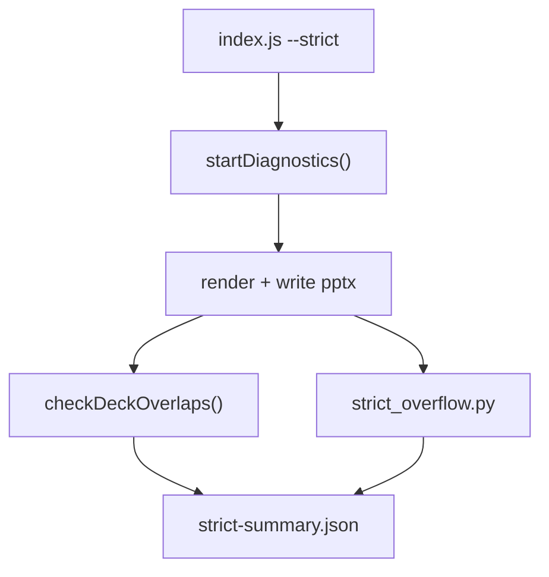

# KPMG Slide Generator Architecture

This document describes the current architecture used by the KPMG PPTX generator, file by file.

Canonical upstream PPTX mined for layout/theme fidelity:

- `/Users/rishi/Code/ai-tools/chatgpt/kpmg-slidegen/pptx-templates/kpmg-diligence/Diligence+ Reporting Template_Widescreen v2.1.pptx`

## 1) Two-Layer Design

## 2) Repository Map

- `/Users/rishi/Code/ai-tools/chatgpt/kpmg-slidegen/pptx-templates/kpmg-diligence`
  Canonical source PowerPoint templates only.
- `/Users/rishi/Code/ai-tools/chatgpt/kpmg-slidegen/templates/kpmg-diligence`
  Generator-owned artifacts (`template.js`, `template.json`, assets, and package JSON).
- `/Users/rishi/Code/ai-tools/chatgpt/kpmg-slidegen/generator`
  Runtime renderer, validators, builders, pagination, and scripts.
- `/Users/rishi/Code/ai-tools/chatgpt/kpmg-slidegen/samples`
  Input deck specs (including lorem stress deck).
- `/Users/rishi/Code/ai-tools/chatgpt/kpmg-slidegen/outputs`
  Generated decks, XML unpack output, and thumbnail QA grids.

## 3) Layer 1: Template Package Build (File by File)

### 3.1 Package Build Files

- `/Users/rishi/Code/ai-tools/chatgpt/kpmg-slidegen/generator/runtime/template-roots.js`
  Resolves template location (`templates/` fallback, `pptx-templates/` preferred) and asset/module paths.
- `/Users/rishi/Code/ai-tools/chatgpt/kpmg-slidegen/generator/scripts/build-template-package.js`
  Generates data-only package outputs:
  - `tokens.json`
  - `layouts.json`
  - `assets/manifest.json`

### 3.2 Build Outputs

- `/Users/rishi/Code/ai-tools/chatgpt/kpmg-slidegen/templates/kpmg-diligence/package/tokens.json`
  Color/font/dimension/theme tokens.
- `/Users/rishi/Code/ai-tools/chatgpt/kpmg-slidegen/templates/kpmg-diligence/package/layouts.json`
  Slide type catalog, slot schema, geometry, master footer/chrome contract, and density rules.
- `/Users/rishi/Code/ai-tools/chatgpt/kpmg-slidegen/templates/kpmg-diligence/package/assets/manifest.json`
  Asset keys mapped to file paths (no base64 payloads).

### 3.3 Package Build Flow

## 4) Layer 2: Runtime Renderer (File by File)

### 4.1 Entrypoints and Runtime Core

- `/Users/rishi/Code/ai-tools/chatgpt/kpmg-slidegen/generator/index.js`
  CLI entrypoint for generation (`--in`, `--out`, `--template`, `--strict`).
- `/Users/rishi/Code/ai-tools/chatgpt/kpmg-slidegen/generator/validate.js`
  CLI validator for `deckSpec` against package-defined slide contracts.
- `/Users/rishi/Code/ai-tools/chatgpt/kpmg-slidegen/generator/runtime/template-package.js`
  Loads `tokens/layouts/assets` JSON package and resolves runtime asset paths.
- `/Users/rishi/Code/ai-tools/chatgpt/kpmg-slidegen/generator/runtime/render-deck.js`
  Deterministic renderer: schema validation, density enforcement, master definition, slide dispatch, and manual logical page numbering.
- `/Users/rishi/Code/ai-tools/chatgpt/kpmg-slidegen/generator/runtime/paginate.js`
  Overflow splitting for long text and tables using deterministic heuristics and footer-safe bounds.

### 4.2 Render Flow

### 4.3 Master/Chrome Contract

`layouts.json -> masters.footerChrome` controls:

- footer logo placement
- legal text block
- classification text (`Document Classification: KPMG Confidential`)
- separator line
- slide-number text box geometry/style

Logical page numbering is now deterministic in runtime and excludes cover/divider/back cover slides.

## 5) Builder Layer (File by File)

### 5.1 Builder Files

- `/Users/rishi/Code/ai-tools/chatgpt/kpmg-slidegen/generator/builders/cover-slide.js`
- `/Users/rishi/Code/ai-tools/chatgpt/kpmg-slidegen/generator/builders/contents-slide.js`
- `/Users/rishi/Code/ai-tools/chatgpt/kpmg-slidegen/generator/builders/divider-slide.js`
- `/Users/rishi/Code/ai-tools/chatgpt/kpmg-slidegen/generator/builders/summary-financials.js`
- `/Users/rishi/Code/ai-tools/chatgpt/kpmg-slidegen/generator/builders/analysis-wide-chart-text.js`
- `/Users/rishi/Code/ai-tools/chatgpt/kpmg-slidegen/generator/builders/analysis-narrow-table.js`
- `/Users/rishi/Code/ai-tools/chatgpt/kpmg-slidegen/generator/builders/two-column-text.js`
- `/Users/rishi/Code/ai-tools/chatgpt/kpmg-slidegen/generator/builders/one-column-text.js`
- `/Users/rishi/Code/ai-tools/chatgpt/kpmg-slidegen/generator/builders/title-strapline-4-boxes.js`
- `/Users/rishi/Code/ai-tools/chatgpt/kpmg-slidegen/generator/builders/profit-loss-overview.js`
- `/Users/rishi/Code/ai-tools/chatgpt/kpmg-slidegen/generator/builders/back-cover-slide.js`

### 5.2 Builder Dispatch Graph

### 5.3 Shared Helpers Used by Builders

- `/Users/rishi/Code/ai-tools/chatgpt/kpmg-slidegen/generator/tokens.js`
- `/Users/rishi/Code/ai-tools/chatgpt/kpmg-slidegen/generator/helpers/title.js`
- `/Users/rishi/Code/ai-tools/chatgpt/kpmg-slidegen/generator/helpers/text.js`
- `/Users/rishi/Code/ai-tools/chatgpt/kpmg-slidegen/generator/helpers/bullets.js`
- `/Users/rishi/Code/ai-tools/chatgpt/kpmg-slidegen/generator/helpers/chart.js`
- `/Users/rishi/Code/ai-tools/chatgpt/kpmg-slidegen/generator/helpers/media.js`
- `/Users/rishi/Code/ai-tools/chatgpt/kpmg-slidegen/generator/helpers/footer.js`
- `/Users/rishi/Code/ai-tools/chatgpt/kpmg-slidegen/generator/helpers/geometry.js`

## 6) QA and Strict Diagnostics (File by File)

- `/Users/rishi/Code/ai-tools/chatgpt/kpmg-slidegen/generator/runtime/diagnostics.js`
  Tracks warnings, missing required slots, and fallback usage.
- `/Users/rishi/Code/ai-tools/chatgpt/kpmg-slidegen/generator/strict/overlap.js`
  Detects overlap/containment risk across rendered objects.
- `/Users/rishi/Code/ai-tools/chatgpt/kpmg-slidegen/qa/strict_overflow.py`
  Optional image-based overflow QA.

## 7) New/Upgraded Slide Types and Contracts

From `layouts.json`:

- `dividerDark` and `dividerLight` variants (dark and light section dividers)
- `qualityOfEarnings` with default large text-box scaffold behavior
- `summaryFinancialsScaffold` for Diligence+ panel-style summary background scaffolding

## 8) Commands Used in This Architecture

- Build package data:
  - `node /Users/rishi/Code/ai-tools/chatgpt/kpmg-slidegen/generator/scripts/build-template-package.js --template kpmg-diligence`
- Build all-layout blank catalog spec:
  - `node /Users/rishi/Code/ai-tools/chatgpt/kpmg-slidegen/generator/scripts/build-layout-catalog-spec.js --template kpmg-diligence --out /Users/rishi/Code/ai-tools/chatgpt/kpmg-slidegen/outputs/layouts-all-blank-spec.json`
- Validate spec:
  - `node /Users/rishi/Code/ai-tools/chatgpt/kpmg-slidegen/generator/validate.js --in <deck.json> --template kpmg-diligence`
- Render deck:
  - `node /Users/rishi/Code/ai-tools/chatgpt/kpmg-slidegen/generator/index.js --in <deck.json> --out <deck.pptx> --template kpmg-diligence`

## 9) Visual QA Assets

- Template thumbnail grid:
  - `/Users/rishi/Code/ai-tools/chatgpt/kpmg-slidegen/outputs/compare/template-v2.1-grid-1.jpg`
  - `/Users/rishi/Code/ai-tools/chatgpt/kpmg-slidegen/outputs/compare/template-v2.1-grid-2.jpg`
- Generated blank layout catalog grid:
  - `/Users/rishi/Code/ai-tools/chatgpt/kpmg-slidegen/outputs/compare/layouts-all-blank-grid.jpg`
- Generated lorem stress deck grid:
  - `/Users/rishi/Code/ai-tools/chatgpt/kpmg-slidegen/outputs/compare/lorem-heavy-sample-grid.jpg`
