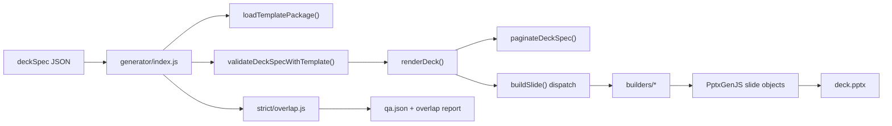
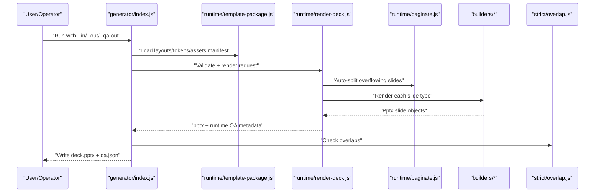
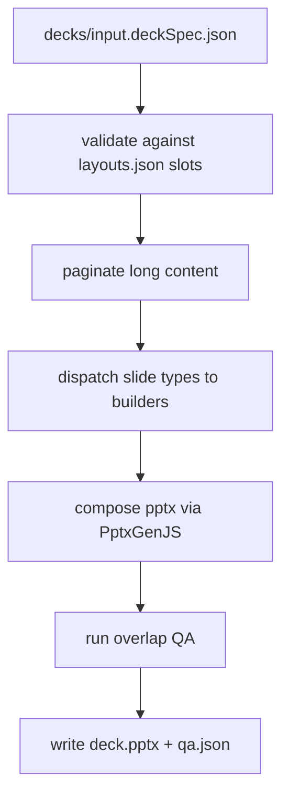

# KPMG Slide Generator (Minimal Runtime Edition)

This repository is the **runtime-minimal** version of the KPMG slide generator.
It contains only the files required to turn a `deckSpec` JSON into a `.pptx` file with a QA report.

Use this document as the single source explaining how everything fits together.

## 1) What This Repo Does

Input:
- A deck JSON file in `decks/input.deckSpec.json` format.

Output:
- A PowerPoint file (`.pptx`).
- A QA report (`.json`) with validation and overlap checks.

Core command:

```bash
cd /Users/rishi/Code/ai-tools/chatgpt/kpmg-slidegen
node generator/index.js \
  --in decks/input.deckSpec.json \
  --out outputs/my-run/deck.pptx \
  --qa-out outputs/my-run/qa.json
```

---

## 2) End-to-End Flow



### Render Sequence



---

## 3) Folder Structure

```text
/Users/rishi/Code/ai-tools/chatgpt/kpmg-slidegen/
├── README.md
├── decks/
│   └── input.deckSpec.json
├── generator/
│   ├── index.js
│   ├── tokens.js
│   ├── builders/
│   ├── helpers/
│   ├── runtime/
│   └── strict/
├── templates/
│   └── kpmg-diligence/
│       ├── assets/
│       └── package/
│           ├── layouts.json
│           ├── tokens.json
│           └── assets/manifest.json
└── node_modules/
```

---

## 4) File-by-File Responsibilities

## Deck Input
- `decks/input.deckSpec.json`
  - The current deck specification.
  - Contains deck metadata and ordered `slides[]`.
  - Each slide has a `type` plus type-specific fields (for example `title`, `body`, `chart`, `table`, `sectionNumber`).

## Main Entry
- `generator/index.js`
  - CLI entry point.
  - Reads input JSON, loads template package, validates content, renders PPTX, runs overlap checks, writes QA report.
  - Primary exports: `generateToFile()`, `main()`.

## Runtime Layer
- `generator/runtime/render-deck.js`
  - Core orchestration logic.
  - Validates each slide against template slot expectations.
  - Defines slide masters from template config.
  - Applies pagination output.
  - Dispatches each slide type to the proper builder.
  - Adds logical page numbers and optional notes.

- `generator/runtime/paginate.js`
  - Heuristic pagination engine.
  - Splits large text/table content into continuation slides to avoid overlap.
  - Tracks `paginationDecisions` and `overflowEvents`.

- `generator/runtime/template-package.js`
  - Loads template package files:
    - `templates/kpmg-diligence/package/tokens.json`
    - `templates/kpmg-diligence/package/layouts.json`
    - `templates/kpmg-diligence/package/assets/manifest.json`
  - Exposes `resolveAssetPath()` for builders.

- `generator/runtime/template-roots.js`
  - Resolves repository-relative template paths.
  - Primary source of template directory resolution.

- `generator/runtime/diagnostics.js`
  - Collects runtime warnings/fallbacks/missing-slot diagnostics.
  - Used by `index.js` when producing QA output.

## Strict QA
- `generator/strict/overlap.js`
  - Detects slide element overlap risk.
  - Produces overlap summary/report written by `index.js`.

## Builders (Slide Renderers)
- `generator/builders/cover-slide.js`
  - Renders cover slide.

- `generator/builders/divider-slide.js`
  - Renders divider section slides (dark/light variants).

- `generator/builders/contents-slide.js`
  - Renders contents/index slide.

- `generator/builders/one-column-text.js`
  - Renders single-column text narrative slides.

- `generator/builders/two-column-text.js`
  - Renders two-column narrative slides.

- `generator/builders/analysis-narrow-table.js`
  - Renders table-first analytical slides (with optional notes/side narrative depending on spec).

- `generator/builders/analysis-wide-chart-text.js`
  - Renders chart+text analytical slides:
    - `analysisWideChart2ColsText`
    - `analysisWideChartTableText`

- `generator/builders/profit-loss-overview.js`
  - Renders scaffold variant currently mapped from `analysisWideChartTableTextScaffold`.

- `generator/builders/title-strapline-4-boxes.js`
  - Renders title + strapline + 4 text box layout.

- `generator/builders/back-cover-slide.js`
  - Renders the hardcoded closing/back-cover slide.

## Helpers (Shared Utilities)
- `generator/helpers/title.js`
  - Shared title rendering helper.

- `generator/helpers/text.js`
  - Text sanitization and sizing helpers.

- `generator/helpers/bullets.js`
  - Bullet run conversion helpers.

- `generator/helpers/chart.js`
  - Chart visual helper utilities.

- `generator/helpers/geometry.js`
  - Geometry checks and layout safety helpers.

- `generator/helpers/footer.js`
  - Footer logo/safe-area utilities used by pagination/layout logic.

- `generator/helpers/media.js`
  - Image/source normalization and sizing helpers.

- `generator/helpers/svg.js`
  - SVG sanitization and data-URI conversion helpers.

## Design Tokens
- `generator/tokens.js`
  - Code-level design constants for typography, colors, chart palettes, sizing, and bullet settings.

## Template Package (Contract + Assets)
- `templates/kpmg-diligence/package/layouts.json`
  - Runtime layout contract.
  - Defines `types` (slide types), geometry boxes, slot requirements, density rules, and master variant configuration.

- `templates/kpmg-diligence/package/tokens.json`
  - Extracted template-level tokens (dimensions, fonts, colors, styles).

- `templates/kpmg-diligence/package/assets/manifest.json`
  - Logical asset key to file path map (for `resolveAssetPath`).

## Template Assets (Physical Files)
- `templates/kpmg-diligence/assets/kpmg-logo.svg`
- `templates/kpmg-diligence/assets/kpmg-logo-white.svg`
- `templates/kpmg-diligence/assets/kpmg-logo-white.png`
- `templates/kpmg-diligence/assets/cover-photo.jpeg`
- `templates/kpmg-diligence/assets/gradient_divider_window_300dpi.png`
- `templates/kpmg-diligence/assets/gradient_back_cover_300dpi.png`
- `templates/kpmg-diligence/assets/gradient_accent_chip_300dpi.png`
- `templates/kpmg-diligence/assets/closing-logo-white.png`
- `templates/kpmg-diligence/assets/closing-social-twitter.png`
- `templates/kpmg-diligence/assets/closing-social-linkedin.png`
- `templates/kpmg-diligence/assets/closing-social-facebook.png`
- `templates/kpmg-diligence/assets/closing-social-instagram.png`
- `templates/kpmg-diligence/assets/closing-social-youtube.png`
- `templates/kpmg-diligence/assets/closing-nav-icons.png`

## Runtime Dependencies
- `node_modules/`
  - Vendored dependencies required at runtime (for example `pptxgenjs`, `image-size`, and transitive packages).
  - This minimal repo currently depends on these being present.

---

## 5) Slide Type to Builder Mapping

The dispatch happens in `generator/runtime/render-deck.js`.

| Slide Type | Builder |
|---|---|
| `cover` | `addCover` |
| `divider`, `dividerDark`, `dividerLight` | `addDivider` |
| `contents` | `addContentsSlide` |
| `twoColumnText`, `analysis2ColumnsText` | `addTwoColumnTextWithStrapline` |
| `oneColumnText`, `qualityOfEarnings` | `addOneColumnText` |
| `analysisNarrowTable` | `addAnalysisNarrowTable` |
| `analysisWideChart2ColsText` | `addAnalysisWideChart2ColsText` |
| `analysisWideChartTableText` | `addAnalysisWideChartTableText` |
| `analysisWideChartTableTextScaffold` | `addProfitLossOverview` |
| `titleStrapline4TextBoxes` | `addTitleStrapline4TextBoxes` |
| `backCover` | `addBackCover` |

---

## 6) Data Contracts and Validation

Validation path:
1. `index.js` calls `validateDeckSpecWithTemplate()`.
2. Validation uses `layouts.json` slot definitions per slide type.
3. Missing/invalid slots, density issues, and repair hints are aggregated into QA.

Important runtime checks include:
- Required slot presence.
- Slot type/shape checks (`text`, `textArray`, `table`, `chart`, etc.).
- Density thresholds (`ok`, `thin but acceptable`, `too sparse, should be repaired or flagged`).
- Repeated body-line warnings.

---

## 7) Pagination Model

Pagination is automatic and conservative:
- Long bullet bodies are split into continuation slides (`(cont.)`).
- Table rows are split over multiple pages if they exceed geometry budget.
- Chart+text slides keep chart context while text continues.

This is done in `generator/runtime/paginate.js`, before final slide rendering.

---

## 8) Masters, Footer, and Logical Page Numbers

`render-deck.js` defines masters from `layouts.json` (`masters.variants`) and overlays footer chrome where configured.

Logical page numbers:
- Excludes cover/divider/backCover from numbering.
- Adds page number only where master variant includes footer.

---

## 9) Output Artifacts

Given:

```bash
--out outputs/my-run/deck.pptx --qa-out outputs/my-run/qa.json
```

You will get:
- `outputs/my-run/deck.pptx`
- `outputs/my-run/qa.json`
- optional overlap report path based on QA naming rules

---

## 10) Operational Notes

- This minimal repo intentionally omits orchestration skills, prompt stages, and external docs.
- It is a direct renderer runtime.
- `node_modules` is required in this trimmed state.
- `generator/index.js --strict` references `qa/strict_overflow.py`; that script is not part of this minimal cut, so avoid strict-overflow mode unless you add that script back.

---

## 11) Quick Troubleshooting

`ERR_MODULE_NOT_FOUND: pptxgenjs`
- Ensure `node_modules/pptxgenjs` exists.

`Unknown type: <type>`
- The slide type is not mapped in `buildSlide()` in `generator/runtime/render-deck.js`.

`Missing required: <slot>`
- Check the slide type contract in `templates/kpmg-diligence/package/layouts.json` and fill required fields in `decks/input.deckSpec.json`.

`Master mismatch detected`
- The slide was rendered on a different master than expected; check `getMasterNameForSlide()` and master definitions in `layouts.json`.

---

## 12) One-Page Mental Model



If you understand those seven steps, you understand the full minimal system.
