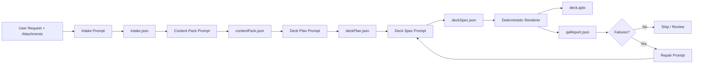
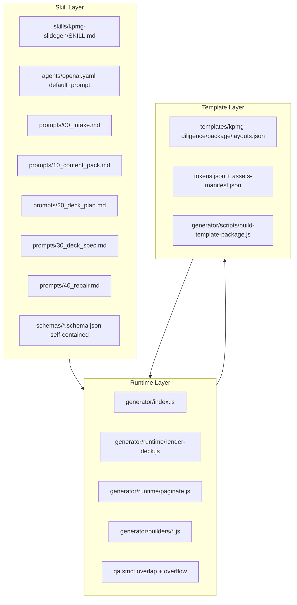
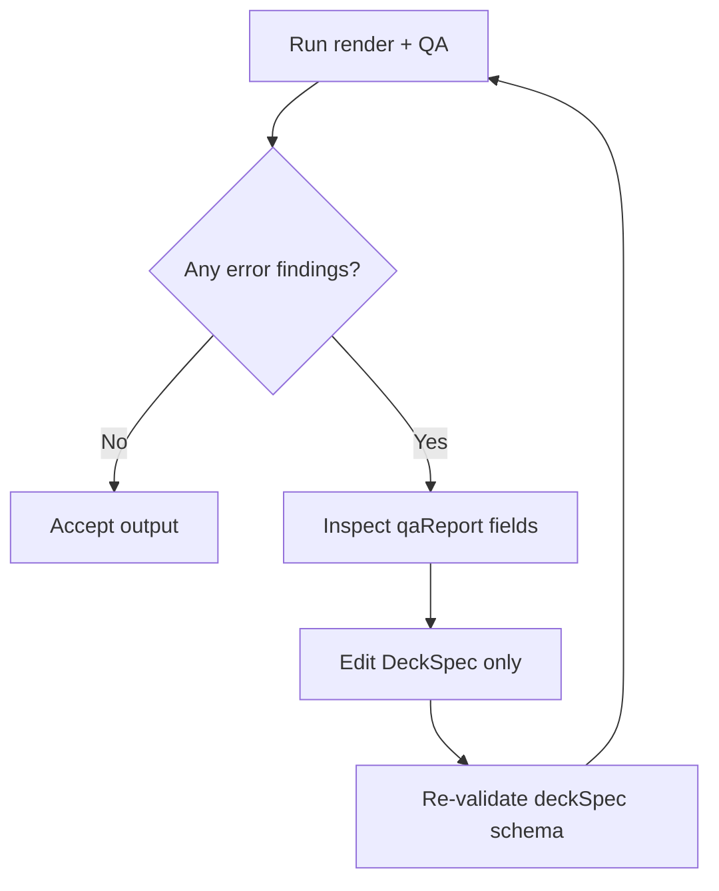

# Layout Slot Reference

## Purpose

This README is the canonical operator guide for KPMG SlideGen.

It combines:

1. The full layout-slot reference (migrated from `docs/kpmg-diligence-layout-slot-reference.md`).
2. How orchestration works across intake, content pack, deck plan, deck spec, render, QA, and repair.
3. Practical quality controls to make generation resilient and review-friendly.

## System Overview

### End-to-end artifact flow

### Component map

### Repair decision loop

## What Each Area Does

### Orchestrator

Primary file: `skills/kpmg-slidegen/agents/openai.yaml`

Responsibilities:

- Enforces stage order.
- Enforces schema validation between stages.
- Enforces repair loop when QA fails.
- Keeps LLM work constrained to planning/specification, not runtime layout improvisation.

Hard rules:

- Never invent numbers.
- Only use catalog-approved slide types.
- Repair by editing `deckSpec` only.

### Deck Plan

Primary references:

- Prompt: `skills/kpmg-slidegen/prompts/20_deck_plan.md`
- Schema: `schemas/deckPlan.schema.json`

Responsibilities:

- Choose narrative sequence.
- Assign slide `type` per narrative intent.
- Keep sections explicit with divider slides.
- Stay feasible given available content blocks.

Minimum contract:

- Must output `slides[]`.
- Each slide needs `title`, `type`, and `intent`.
- `type` must be one of the approved enum values.

### Deck Spec

Primary references:

- Prompt: `skills/kpmg-slidegen/prompts/30_deck_spec.md`
- Canonical schema: `schemas/deckSpec.schema.json`

Responsibilities:

- Convert plan into renderable slot payloads.
- Satisfy per-layout slot requirements and minimum density.
- Keep placeholder assumptions explicit if data is missing.

Minimum contract:

- Must output `slides[]`.
- Every slide must satisfy its type contract.
- Slot payload kinds must match schema (`text`, `textArray`, `table`, `chart`, `columns`, `contents.sections`, etc.).

### Renderer and Pagination

Primary references:

- `generator/index.js`
- `generator/runtime/render-deck.js`
- `generator/runtime/paginate.js`

Responsibilities:

- Deterministically render the PPTX.
- Apply slide masters by type.
- Auto-split overflowing content into continuation slides.
- Auto-generate TOC `pageRange` values from divider section markers.
- Emit QA and strict diagnostics.

### QA and Repair

Primary references:

- Canonical schema: `schemas/qaReport.schema.json`
- Repair prompt: `skills/kpmg-slidegen/prompts/40_repair.md`

Responsibilities:

- Detect missing required slots.
- Score density and flag sparse/thin slides.
- Detect pagination splits and overflow risk.
- Verify master consistency.
- Feed actionable suggestions back into DeckSpec edits.

## Artifact Contracts (Quick Visual)

| Artifact | Produced By | Core Purpose | Validation |
|---|---|---|---|
| `intake.json` | `prompts/00_intake.md` | Normalize user goal, scope, constraints | Prompt contract |
| `contentPack.json` | `prompts/10_content_pack.md` | Structured evidence and slot-ready raw content | `schemas/contentPack.schema.json` |
| `deckPlan.json` | `prompts/20_deck_plan.md` | Narrative and slide-type plan | `schemas/deckPlan.schema.json` |
| `deckSpec.json` | `prompts/30_deck_spec.md` | Fully renderable slide slot payloads | `schemas/deckSpec.schema.json` |
| `deck.pptx` | Renderer | Final output deck | Runtime + QA checks |
| `qaReport.json` | Renderer/QA | Findings, risks, and repair hooks | `schemas/qaReport.schema.json` |

## Anti-fragility Design Notes

### Contracts over intuition

- Slot contracts live in template package layouts and schema, not in ad hoc prompt prose.
- The renderer enforces missing slots and density before writing output.

### Determinism over ad hoc layout behavior

- LLM selects structure and content, but does not place objects.
- Geometry and builders own placement.

### Repairable by construction

- QA emits machine-readable `slotIssues`, `repairSuggestions`, `overflowRisks`, and `masterApplied`.
- Repair loop modifies only `deckSpec`, preserving reproducibility.

### Section and pagination resilience

- TOC ranges are computed from actual rendered logical pages.
- Continuation slides are auto-labeled with `(cont.)`.

## Runtime Behaviors That Matter in Review

### Footer metadata in non-demo runs

If `allowSparse` is false, non-demo generation requires footer metadata:

- `metadata.footer.year`
- `metadata.footer.legalEntityName`
- `metadata.footer.jurisdiction`
- `metadata.footer.legalStructure`

Missing values fail render.

### TOC page ranges are auto-written

`contents.sections[*].pageRange` is auto-computed from final paginated output using divider section markers (`sectionNumber` and `sectionTitle`).

### Auto-pagination and continuation titles

When content overflows:

- `oneColumnText`, `twoColumnText`, `analysis2ColumnsText`, `analysisWideChart2ColsText`, `analysisWideChartTableText` split bullet content.
- `analysisNarrowTable` splits table rows by estimated row height.
- Continuation titles are `Original Title (cont.)`.

### Logical page numbering exclusions

Slide numbers are not rendered on:

- `cover`
- `backCover`
- `divider`
- `dividerDark`
- `dividerLight`

### Section grouping behavior

PowerPoint section creation is disabled in runtime render, so generated decks stay in one section group.

### Table visual defaults

Default analysis table styling uses:

- Dark title bar when enabled by layout.
- Cobalt separator line under title bar.
- Blue column header row.
- Subtle body grid lines.

For `analysisWideChartTableText` and `analysisWideChartTableTextScaffold`, table title bars are intentionally disabled to avoid duplicate heading stacks.

## Source-of-Truth File Map

- Skill overview: `skills/kpmg-slidegen/SKILL.md`
- Orchestrator workflow: `skills/kpmg-slidegen/agents/openai.yaml`
- Harness mirror (generated copy): `.agents/skills/kpmg-slidegen/`
- Stage prompts:
  - `skills/kpmg-slidegen/prompts/00_intake.md`
  - `skills/kpmg-slidegen/prompts/10_content_pack.md`
  - `skills/kpmg-slidegen/prompts/20_deck_plan.md`
  - `skills/kpmg-slidegen/prompts/30_deck_spec.md`
  - `skills/kpmg-slidegen/prompts/40_repair.md`
- Canonical schemas:
  - `schemas/contentPack.schema.json`
  - `schemas/deckPlan.schema.json`
  - `schemas/deckSpec.schema.json`
  - `schemas/qaReport.schema.json`
- Template package contract source:
  - `templates/kpmg-diligence/package/layouts.json`
- Slot defaults and density policy generator:
  - `generator/scripts/build-template-package.js`
- Runtime:
  - `generator/index.js`
  - `generator/runtime/render-deck.js`
  - `generator/runtime/paginate.js`
- Builders:
  - `generator/builders/analysis-narrow-table.js`
  - `generator/builders/analysis-wide-chart-text.js`
  - `generator/builders/back-cover-slide.js`

## Scope

This section covers the 15 layout types currently generated in the per-layout review pack.

It explains:

1. Which slots each layout expects.
2. How slot content is mapped into the slide.
3. Review constraints and implementation behaviors that matter during QA.

## Slot Payload Formats

Use these payload shapes consistently across layouts:

- `text`: non-empty string.
- `textArray`: array of bullet items. Each item can be:
  - string, or
  - object `{ "text": "...", "header": true|false }`.
- `table`: object:
  - `headers`: array of strings/numbers.
  - `rows`: array of row arrays (strings/numbers).
- `chart`: object:
  - `type`: chart type string.
  - `data`: array of series; each series has `values` and optionally `name`, `labels`.
  - optional `opts`, optional `source`.
- `columns`: array of objects, each with at least one of:
  - `heading`, `title`, or `body` (`body` is `textArray`).
- `contents.sections`: array of objects:
  - `number` (two digits, example `"01"`),
  - `title`,
  - optional `pageRange`,
  - `items` (array of strings).

## Layout Map (15 Review Layouts)

### `cover`

- Required slots:
  - `title` (`text`)
  - `subtitle` (`text`)
- Content mapping:
  - Title and subtitle are rendered in hero area over cover visual/master.
- Review notes:
  - Keep title concise; this layout is visual-first and can feel crowded with long subtitle copy.

### `contents`

- Required slots:
  - `title` (`text`)
  - `sections` (`contentsSections`, min 8)
- Content mapping:
  - Sections are laid out in two rows (up to 5 top + 5 bottom).
  - Each section shows number, title, page range, and item list.
- Review notes:
  - Top-right utility links are removed.
  - Page ranges are auto-computed when divider markers are present.

### `divider`

- Required slots:
  - `sectionNumber` (`text`, exactly 2 chars)
  - `sectionTitle` (`text`)
- Content mapping:
  - Number + title over dark section style.
- Review notes:
  - Divider slides define section context used by TOC auto-range logic.

### `dividerDark`

- Required slots:
  - `sectionNumber`
  - `sectionTitle`
- Content mapping:
  - Same as `divider`, explicit dark variant.
- Review notes:
  - Functionally equivalent in section tracking behavior.

### `dividerLight`

- Required slots:
  - `sectionNumber`
  - `sectionTitle`
- Content mapping:
  - Light section opener variant.
- Review notes:
  - Included in per-layout pack and can be used for lighter section transitions.

### `analysisWideChartTableTextScaffold`

- Required slots:
  - `title`
- Optional slots:
  - `strapline`, `heading`, `body`, `chart`, `table`, `noteSource`
- Content mapping:
  - Scaffold-style composition with heading band, left table region, right narrative region.
  - Chart region exists in geometry but chart rendering is off by default unless explicitly enabled.
- Review notes:
  - Used as a scaffold/working slide, not intended as a polished final by default.

### `analysisWideChart2ColsText`

- Required slots:
  - `title`
  - `body` (`textArray`, min 4)
  - `chart`
- Optional slots:
  - `strapline`
- Content mapping:
  - Left narrative bullets, right chart.
- Review notes:
  - On overflow, bullets split into continuation slides while chart repeats.

### `analysisWideChartTableText`

- Required slots:
  - `title`
  - `body` (`textArray`, min 4)
  - `chart`
- Optional slots:
  - `strapline`, `heading`, `table`, `noteSource`
- Content mapping:
  - Strapline at top, heading band below, table block on left lower panel, narrative bullets on right lower panel.
  - Chart can be hidden by default unless `showChart` or `showSummaryChart` is enabled.
- Review notes:
  - Use `heading` for subheader semantics.
  - Table title bar is disabled here (heading band already serves as visual header).

### `analysisNarrowTable`

- Required slots:
  - `title`
  - `table` (min 3 rows)
- Optional slots:
  - `strapline`, `notes`, `insightTitle`
- Content mapping:
  - Left table + right insights column.
  - `insightTitle` drives right-panel heading (dynamic, not hardcoded).
- Review notes:
  - Uses row-height-aware pagination and table continuation support.
  - Default table style includes title bar + cobalt separator + blue headers.

### `twoColumnText`

- Required slots:
  - `title`
  - `leftBody` (min 2)
  - `rightBody` (min 2)
- Optional slots:
  - `strapline`
- Content mapping:
  - Traditional two-column narrative.
- Review notes:
  - Both columns are paginated together to avoid overlap; continuation titles are auto-added.

### `analysis2ColumnsText`

- Required slots:
  - `title`
  - `leftBody` (min 2)
  - `rightBody` (min 2)
- Optional slots:
  - `strapline`
- Content mapping:
  - Same rendering family as `twoColumnText`.
- Review notes:
  - Same pagination behavior and constraints as `twoColumnText`.

### `oneColumnText`

- Required slots:
  - `title`
  - `body` (min 3)
- Optional slots:
  - `strapline`
- Content mapping:
  - Strapline and one large bullet narrative body area.
- Review notes:
  - Strapline/body spacing uses dynamic offsets to reduce overlap risk.

### `qualityOfEarnings`

- Required slots:
  - `title`
- Optional slots:
  - `strapline`, `body`, `source`
- Content mapping:
  - Uses one-column text builder and one-column geometry path.
- Review notes:
  - Full-page QoE scaffold rectangle is removed.
  - Treat as content-driven narrative unless a dedicated QoE visualization layout is introduced.

### `titleStrapline4TextBoxes`

- Required slots:
  - `title`
  - `columns` (min 4)
- Optional slots:
  - `strapline`
- Content mapping:
  - Four workstream/column boxes under title and strapline.
- Review notes:
  - Each column should include a heading plus short body bullets for balanced density.

### `backCover`

- Required slots:
  - none
- Optional slots:
  - `disclaimer`, `url`
- Content mapping:
  - Fixed contact-closing composition with logo, contacts, social icons, legal lines, classification, and URL.
  - Top-right home icon is removed.
- Review notes:
  - If disclaimer/url are not provided, defaults are used.
  - Footer legal metadata still flows from `metadata.footer`.

## Additional Types Not in the 15-Layout Review Pack

These exist in template/schema but were intentionally excluded from the latest per-layout pack:

- `summaryFinancials`
- `summaryFinancialsScaffold`

Both map to scaffold-style summary behavior and are not part of the streamlined review set.

## Reviewer Checklist (Fast Pass)

Use this pass when reviewing each one-layout PPT:

1. Slot fill behavior: content appears in intended region and hierarchy.
2. Overflow behavior: no text/table clipping; continuations are acceptable.
3. Header logic: no duplicate title bars where heading bands already exist.
4. Footer integrity: legal line, classification, and slide number behavior are correct.
5. Layout parity: visual style aligns with intended KPMG presentation standard for that type.

## Quality-Improvement Checklist for Next Iterations

Use this during refactors to keep quality high while simplifying:

- Keep all slot requirement changes in one place: `generator/scripts/build-template-package.js`.
- Run `node generator/scripts/check-slot-contract-sync.js` after slot/layout edits to verify schema contract sync.
- Keep renderer deterministic; avoid adding LLM-only style branches.
- Prefer layout switching over slot overloading when density rises.
- Add regression QA fixtures for any builder geometry change.
- Preserve repairability by ensuring new findings map to `repairSuggestions` hooks.
- Treat TOC and logical page numbering as runtime outputs, not manual authoring data.
