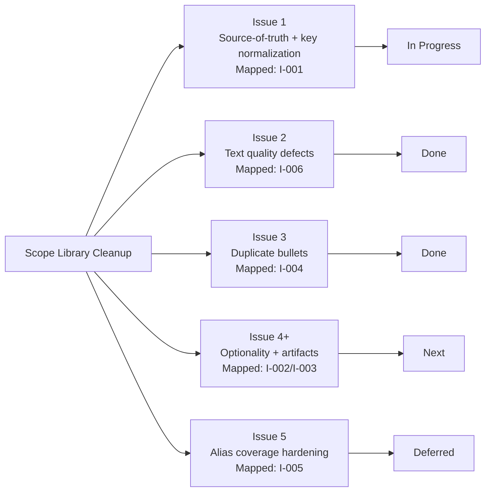
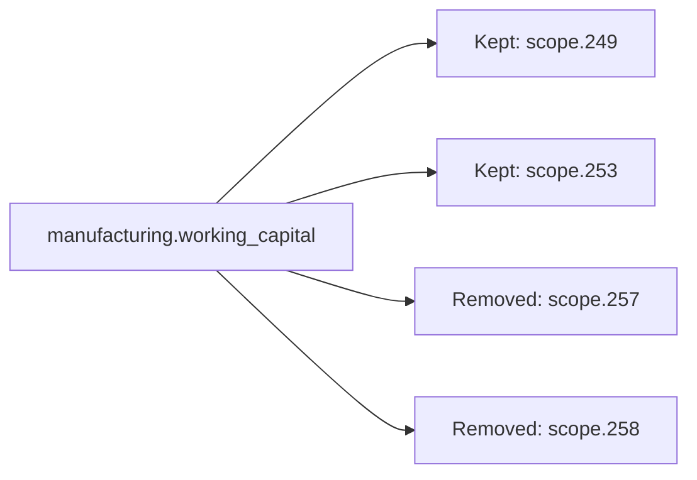
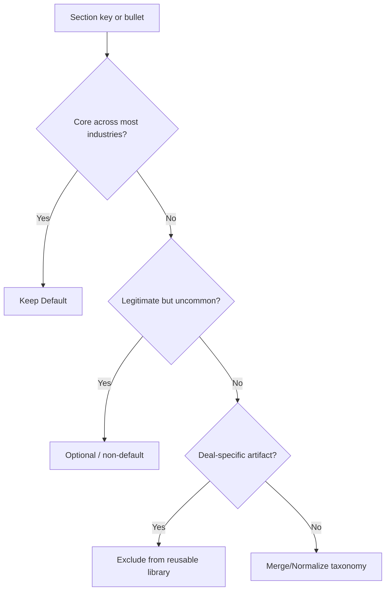

# Scope Issue Visualization Guide

This page is a visual companion to `docs/issues.md` and reflects the current post-cleanup state.

## 1) Progress Map With Issue IDs

## 2) I-001 Canonical Key Map (Applied)

```mermaid
flowchart TB
  A[audit_work_paper] --> A1[audit_work_papers]
  A --> A2[audit_working_papers]

  B[inventory] --> B1[inventories]

  C[related_parties] --> C1[related_party_transactions]

  D[work_in_progress] --> D1[work_in_progress_and_backlog]

  E[supporting_analysis_*] --> E1[supporting_analysis_for_quality_of_earnings]
  E --> E2[supporting_analysis_to_quality_of_earnings]

  F[prepaids/other_assets cluster] --> F1[other_assets]
  F --> F2[other_assets_and_liabilities]
  F --> F3[other_current_assets]
  F --> F4[other_current_assets_liabilities]
  F --> F5[prepaids]
  F --> F6[prepaids_and_other_current_assets]
  F --> F7[prepaid_expenses_and_other_assets]
  F --> F8[prepaid_materials_and_other_assets]
```

## 3) I-004 Duplicate Hotspot (Resolved)

Duplicate detector status: `0` duplicate sections remaining.

## 4) Issue Decision Funnel (I-001/I-002/I-003/I-005)

## 5) Key Sets By Issue Number

### I-001 applied key migrations

- `audit_work_papers` -> `audit_work_paper`
- `audit_working_papers` -> `audit_work_paper`
- `inventories` -> `inventory`
- `related_party_transactions` -> `related_parties`
- `work_in_progress_and_backlog` -> `work_in_progress`

### I-004 applied duplicate removals

- Removed `manufacturing.working_capital.scope.257`
- Removed `manufacturing.working_capital.scope.258`

### I-003 artifact review set (next)

- `financial_due_diligence`
- `optional_fdd_procedures`
- `phase_2_post_bid_support`
- `phase_1_gaap_considerations`
- `assistance_with_transaction_documentation`

### I-005 alias-coverage gap set (deprioritized; address after scope cleanup)

- `aspe_to_ifrs_us_gaap_assessment`
- `assistance_with_transaction_documentation`
- `budget`
- `budget_vs_actual`
- `customer_base_health_da`
- `data_and_analytics`
- `financial_due_diligence`
- `forecast_and_budget_analysis`
- `marketing_and_advertising_performance_da`
- `normalized_ebitda_bridges`
- `operating_cash_flow_funds_from_operations`
- `operational_cost_margin_assessment`
- `operations_performance_da`
- `optional_fdd_procedures`
- `other_assets`
- `other_assets_and_liabilities`
- `other_current_assets`
- `other_current_assets_liabilities`
- `phase_1_gaap_considerations`
- `phase_2_post_bid_support`
- `prepaid_expenses_and_other_assets`
- `prepaid_materials_and_other_assets`
- `prepaids`
- `prepaids_and_other_current_assets`
- `purchase_and_sale_agreement`
- `quality_of_revenue_and_receivables_and_cash_proof`
- `revenue_and_profitability_analysis_da`
- `supporting_analysis_for_quality_of_earnings`
- `supporting_analysis_to_quality_of_earnings`
- `waterfall_revenue_analysis`

## 6) Completed Visual Pack (Current Data)

### 6.1 I-001 + I-005 Key-to-Bucket Matrix (`section_to_bucket`)

| Bucket key | Issue link | Key count | Keys |
|---|---|---:|---|
| `core_financial_performance` | I-001 | 9 | `accounting_overview`, `business_overview`, `financial_due_diligence`, `normalized_ebitda_bridges`, `operating_cash_flow_funds_from_operations`, `quality_of_earnings`, `quality_of_revenue_and_receivables_and_cash_proof`, `supporting_analysis_for_quality_of_earnings`, `supporting_analysis_to_quality_of_earnings` |
| `operational_and_commercial_analysis` | I-001 | 14 | `arr_drivers`, `budget`, `budget_vs_actual`, `customer_base_health_da`, `data_and_analytics`, `forecast_and_budget_analysis`, `marketing_and_advertising_performance_da`, `operating_expenses`, `operational_cost_margin_assessment`, `operations_performance_da`, `revenue_analysis`, `revenue_and_profitability_analysis_da`, `store_portfolio_analysis`, `waterfall_revenue_analysis` |
| `balance_sheet_analysis` | I-001 | 17 | `accounts_payable_and_accrued_liabilities`, `accounts_receivable`, `balance_sheet`, `capital_expenditure_requirements`, `inventory`, `locked_box`, `net_debt`, `other_assets`, `other_assets_and_liabilities`, `other_current_assets`, `other_current_assets_liabilities`, `prepaid_expenses_and_other_assets`, `prepaid_materials_and_other_assets`, `prepaids`, `prepaids_and_other_current_assets`, `work_in_progress`, `working_capital` |
| `transaction_support_and_reporting` | I-001/I-003 | 10 | `aspe_to_ifrs_us_gaap_assessment`, `assistance_with_transaction_documentation`, `audit_work_paper`, `commitments_and_contingencies`, `optional_fdd_procedures`, `phase_1_gaap_considerations`, `phase_2_post_bid_support`, `purchase_and_sale_agreement`, `related_parties`, `vdd_report_review` |
| `financial_services_specialty_analysis` | I-001 | 5 | `allowance_for_credit_losses`, `claims_and_reinsurance`, `loan_portfolio_and_credit_quality`, `regulatory_capital_and_liquidity`, `underwriting_and_loss_reserves` |
| `industry_specific_analysis` | I-001 | 0 | _(none)_ |

Alias-coverage snapshot (I-005): `25`/`55` keys have direct alias mapping; `30` keys currently do not.

### 6.2 I-004 Duplicate-Text Detector Output

| Metric | Value |
|---|---:|
| Duplicate hotspot sections | 0 |
| Duplicate groups | 0 |

### 6.3 I-001 Canonical-vs-Variant Status Table

| Family | Canonical key | Variant keys | Status |
|---|---|---|---|
| Audit workpapers | `audit_work_paper` | `audit_work_papers`, `audit_working_papers` | Applied |
| Inventory | `inventory` | `inventories` | Applied |
| Related parties | `related_parties` | `related_party_transactions` | Applied |
| WIP/backlog | `work_in_progress` | `work_in_progress_and_backlog` | Applied |
| Supporting analysis QoE | _TBD_ | `supporting_analysis_for_quality_of_earnings`, `supporting_analysis_to_quality_of_earnings` | Pending |
| Other assets/prepaids cluster | _TBD_ | `other_*`, `prepaid_*`, `prepaids*` | Pending |

### 6.4 I-002 Industry Scope Heatmap (Section Counts + Bullet Load)

Top-level bullet count includes common skeleton + selected industry module.

| Industry | Sections | Top-level bullets | Heat |
|---|---:|---:|---|
| `aerospace` | 4 | 26 | `####` |
| `banking` | 5 | 31 | `#####` |
| `building` | 6 | 32 | `#####` |
| `construction` | 12 | 46 | `########` |
| `eyecare` | 12 | 42 | `#######` |
| `healthcare` | 18 | 62 | `##########` |
| `hvac` | 22 | 117 | `####################` |
| `insurance` | 4 | 28 | `#####` |
| `manufacturing` | 20 | 93 | `################` |
| `prof_services` | 13 | 33 | `######` |
| `real_estate` | 6 | 43 | `#######` |
| `retail` | 5 | 29 | `#####` |
| `service` | 10 | 28 | `#####` |
| `supermarket` | 9 | 49 | `########` |
| `tech` | 11 | 65 | `###########` |
| `telecomm` | 4 | 28 | `#####` |
| `transportation` | 11 | 36 | `######` |

## 7) Fast Navigation By Issue Number

- I-001: sections 2, 5 (applied migrations), 6.1, 6.3
- I-002: section 6.4
- I-003: section 5 (artifact review set), section 6.1 (`transaction_support_and_reporting`)
- I-004: section 3, section 5 (applied removals), section 6.2
- I-005: section 5 (alias-gap set), section 6.1 alias snapshot (deferred)
- I-006: tracked in `docs/issues.md`; text defects resolved in prior phase
