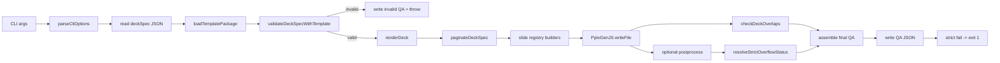

# Architecture

This repo converts typed `deckSpec` JSON into a branded `.pptx` and a consolidated QA JSON report. Optional postprocess steps generate preview PNGs, montage PNGs, and visual-overflow diagnostics.

## System Boundary

- Input: `deckSpec` JSON from `--in` (`generator/index.js`).
- Required outputs: deck at `--out`, QA at `--qa-out` (or auto-derived `.qa.json`).
- Optional outputs: preview/montage/overflow artifacts (`generator/app/postprocess.js`).
- In scope: generation + validation runtime in `generator/`, template contracts in `templates/kpmg-diligence/package/`.
- Out of scope: authoring UI, external APIs, long-running services.

## Module Map

| Boundary | Responsibility | Primary files |
| --- | --- | --- |
| CLI orchestration | Parse flags, load input/template, run generation lifecycle, set exit behavior | `generator/index.js`, `generator/app/cli.js` |
| Postprocess orchestration | Normalize options, run preview/montage/overflow pipelines, publish summary counters | `generator/app/postprocess.js` |
| Strict overflow policy | Map overflow result to strict status (fail-closed), run overflow when strict needs it | `generator/app/strict-overflow.js` |
| Template loading | Load token/layout/pagination/assets package and resolve asset paths | `generator/runtime/template-package.js`, `generator/runtime/template-roots.js` |
| Runtime contracts | Build theme, enforce registry/policy/template parity, validate canonical geometry, cache builder context | `generator/runtime/render-context.js`, `generator/runtime/theme.js`, `generator/runtime/slide-registry.js`, `generator/runtime/template-contracts.js`, `generator/runtime/geometry-contract.js`, `generator/runtime/pagination-policy.js` |
| Validation + render | Validate slots/density, paginate, define masters, dispatch builders, collect render QA | `generator/runtime/render-deck.js`, `generator/runtime/paginate.js` |
| Builder layer | Draw slide visuals from resolved context | `generator/builders/*.js`, `generator/helpers/*.js` |
| Overlap QA | Compute overlap severity findings | `generator/strict/overlap.js` |
| Postprocess adapter/runtime | Detect runtime availability and invoke Python scripts | `generator/postprocess/slides-adapter.js`, `generator/postprocess/slides-runtime/*.py` |

## Runtime Flow



Flow details:
1. CLI parsing (`generator/app/cli.js`) requires `--in` and `--out`.
2. Template package loads contract files (`tokens.json`, `layouts.json`, `pagination-policy.json`, `assets/manifest.json`).
3. Pre-render validation enforces slot shape + density and emits invalid QA when validation fails.
4. Render path paginates first, then dispatches builder functions by slide type.
5. Overlap scan runs unless `--skip-overlap` is set.
6. Optional postprocess runs for explicit flags or strict mode.
7. Strict overflow is derived from visual overflow only and fails closed.
8. QA summary determines pass/fail and strict failure status.

## Slide Types and Policy Keys

Source of truth: `generator/runtime/slide-registry.js` plus `templates/kpmg-diligence/package/pagination-policy.json`.

| Slide type | Builder | Master | Policy key | Logical page number |
| --- | --- | --- | --- | --- |
| `cover` | `addCover` | `KPMG_COVER` | `none.v1` | No |
| `divider` | `addDivider` | `KPMG_SECTION_DARK` | `none.v1` | No |
| `dividerDark` | `addDivider` | `KPMG_SECTION_DARK` | `none.v1` | No |
| `dividerLight` | `addDivider` | `KPMG_SECTION_LIGHT` | `none.v1` | No |
| `contents` | `addContentsSlide` | `KPMG_WHITE` | `contents.sections.v1` | Yes |
| `twoColumnText` | `addTwoColumnTextWithStrapline` | `KPMG_WHITE` | `text.twoColumn.v1` | Yes |
| `oneColumnText` | `addOneColumnText` | `KPMG_WHITE` | `text.oneColumn.v1` | Yes |
| `analysisNarrowTable` | `addAnalysisNarrowTable` | `KPMG_WHITE` | `table.rows.v1` | Yes |
| `analysisWideChart2ColsText` | `addAnalysisWideChart2ColsText` | `KPMG_WHITE` | `text.analysisWide.2cols.v1` | Yes |
| `analysisWideChartTableText` | `addAnalysisWideChartTableText` | `KPMG_WHITE` | `text.analysisWide.table.v1` | Yes |
| `analysisBridge` | `addAnalysisBridge` | `KPMG_WHITE` | `bridge.analysisColumns.v1` | Yes |
| `businessOverview` | `addBusinessOverview` | `KPMG_WHITE` | `business.overviewBody.v1` | Yes |
| `titleStrapline4TextBoxes` | `addTitleStrapline4TextBoxes` | `KPMG_WHITE` | `none.v1` | Yes |
| `backCover` | `addBackCover` | `KPMG_CLOSING` | `none.v1` | No |

## Contract Stack

1. Template package contract: required files must exist (`generator/runtime/template-package.js`).
2. Registry/template parity: all template slide types must exist in runtime registry.
3. Pagination policy contract: policy keys must exist and map to supported strategies.
4. Geometry contract: required canonical geometry keys must exist and remain in slide bounds.
5. Builder context contract: builders consume resolved `geometry`, `assets`, `masterName`, `theme`, `options`, diagnostics.
6. Strict reserved-key guard: in strict mode slide payloads cannot include runtime-owned keys (`masterName`, `geometry`, `assets`).

## Pagination and Logical Paging

`generator/runtime/paginate.js` applies strategy-specific splitting before rendering.

- Text splits use conservative wrapped-line heuristics (no runtime font metrics).
- Table splits budget rows and emit density/orphan warnings.
- Contents splits sections and can recompute logical page ranges.
- Continuation slides apply policy `dropFields` (for example `callouts` on text continuation pages).
- Logical page numbers are drawn only on non-excluded slide types and footer-enabled masters.

## Validation and QA

Validation and QA assembly are centralized in `generator/runtime/render-deck.js` and `generator/index.js`.

- Slot kinds validated: `text`, `textArray`, `stringArray`, `kpiArray`, `columns`, `contentsSections`, `table`, `chart`, `bridge`, `businessStructure`.
- Density statuses: `OK`, `thin but acceptable`, `too sparse, should be repaired or flagged`.
- Invalid decks still emit QA with `valid: false` and `outputSlideCount: 0`.
- Render QA includes pagination decisions, overflow events/risks, table warnings, master checks.
- Overlap QA contributes `overlapSummary`/`overlapFindings`.
- Strict failure condition: strict requested and (`overlapSevere > 0` or `strictOverflow.status !== 0`).

## Postprocess Runtime

`generator/postprocess/slides-adapter.js` wraps bundled scripts in `generator/postprocess/slides-runtime/`.

- Runtime is considered available only when scripts exist and Python is invokable.
- Search order: `SLIDES_SKILL_DIR`, bundled runtime path, repo/home `.agents` paths.
- Preview runs for `--with-preview` and `--with-montage`.
- Montage runs only after successful preview.
- Visual overflow runs for `--with-visual-overflow` and can be auto-run when strict mode needs a result.

## Verification

```bash
node generator/index.js \
  --in decks/qa-golden-all-layouts.deckSpec.json \
  --out outputs/verify-arch/deck.pptx \
  --qa-out outputs/verify-arch/qa.json
```

```bash
node generator/index.js \
  --in decks/qa-golden-all-layouts.deckSpec.json \
  --out outputs/verify-arch/strict-deck.pptx \
  --qa-out outputs/verify-arch/strict-qa.json \
  --strict
```

```bash
npm run -s test:contracts
npm run -s test:contracts:registry
```

Expected signals:
- QA files are written.
- Strict run populates `strictOverflow` and `summary.strict`.
- Contract tests pass for template/registry/policy consistency.
