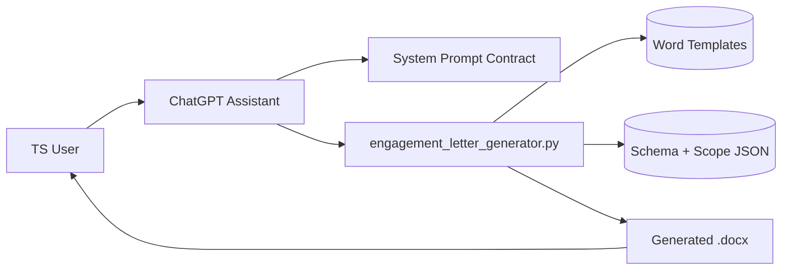
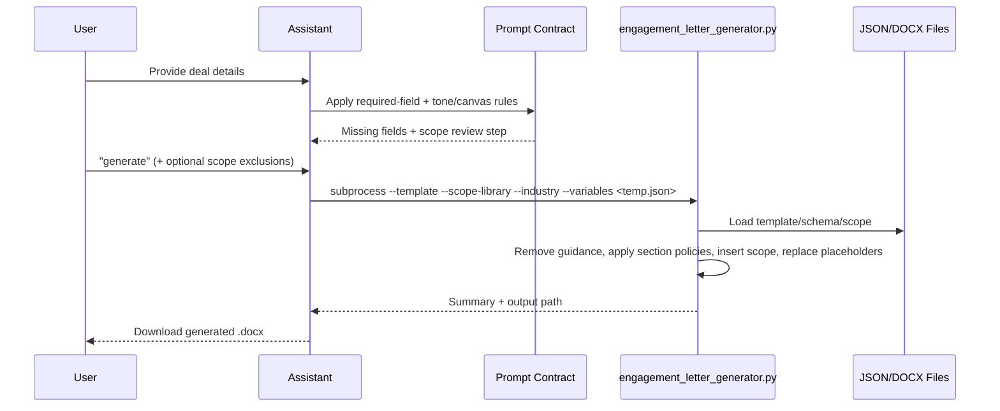
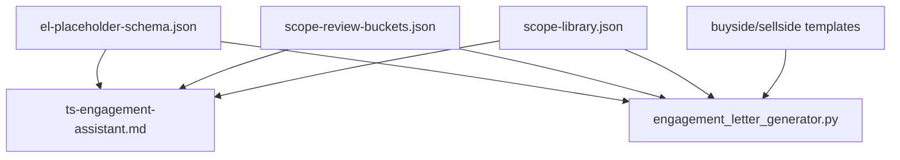

# TS Engagement Assistant Architecture

## Description
This project is a prompt-driven document generation system for KPMG Transaction Services engagement letters. It combines a constrained ChatGPT interview flow with deterministic `.docx` generation so users can collect deal inputs, optionally trim scope sections, and produce legally faithful output without manual template surgery.

## 1. System overview

**Purpose**
- Generate buyside/sellside engagement letters by filling approved Word templates.
- Keep legal wording fixed while allowing controlled placeholder substitution and scope selection.

**Primary goals**
- Reliable first-pass generation with minimal user friction.
- Deterministic output that preserves legal structure and appendix boundaries.
- Strict prompt behavior that does not drift as prompt edits continue.

**Success criteria**
- User can reach `generate` with concise intake and receive a valid `.docx`.
- No unresolved `{{...}}` placeholders remain after generation.
- Scope exclusions apply predictably across common and industry sections.
- Prompt contract remains under size budget and preserves immutable behavior snippets.

**Non-goals**
- Legal rewriting, polishing, or clause redesign.
- Rich document authoring UI beyond the assistant Canvas review layer.

## 2. System boundaries

- In scope:
  - Prompt contract (`dist/ts-engagement-assistant.md`)
  - Generator runtime (`dist/engagement_letter_generator.py`, `dist/scope_engine.py`)
  - Shared scope core (`scope_engine.py`)
  - Template/schema/scope assets in `dist/`
  - Prompt integrity checks + distribution checks in `scripts/`
- Out of scope:
  - External DMS/workflow orchestration
  - Human legal approvals and downstream Word redlining
  - Persistence/database services

## Stack

- Runtime/tooling: Python 3.x, CLI + ChatGPT Code Interpreter style execution
- Language: Python + Markdown + JSON
- Framework/libraries: `python-docx`
- Data/storage: JSON files + `.docx` templates
- Tests/checks: script-based contract and content validation

## Key files and entry points

- `dist/ts-engagement-assistant.md` — system prompt contract and runtime behavior rules
- `dist/assistant-playbook.md` — advisory operating guidance
- `dist/engagement_letter_generator.py` — deterministic generation pipeline
- `dist/scope_engine.py` — runtime scope assembly core
- `dist/el-placeholder-schema.json` — interview fields, required rules, template mapping
- `dist/scope-library.json` — common + industry scope content and nested bullets
- `dist/scope-review-buckets.json` — section bucketing, aliases, concept mappings
- `dist/scope-library-optional.json` — explicit optional scope modules
- `scope_engine.py` — shared scope core for local tooling/runtime parity
- `scripts/run_internal_generation.py` — internal subprocess entrypoint
- `scripts/check-system-prompt-contract.py` — prompt budget + immutable snippet enforcement
- `scripts/export_scope_review_surface.py` — sync/export scope docs by industry

## 3. Architectural style

- Style: Prompt-orchestrated pipeline with deterministic file transformer
- Why it fits:
  - Keeps conversational UX separate from legal template mutation.
  - Allows strict policy in prompt while generation logic remains code-based and testable.
  - Supports incremental hardening via script checks instead of ad hoc behavior.
- Tradeoffs:
  - Requires strict prompt discipline to avoid runtime drift.
  - JSON/schema quality directly impacts user interview quality.
  - No central service/database means state is session-bound.

## 3.1 Dual-distribution model

- ChatGPT upload distribution (`dist/`):
  - minimal runtime assets only
  - deterministic generation path for uploaded files
- Internal testing distribution (`scripts/`, docs export/validation):
  - richer diagnostics and QA checks
  - must use `scripts/run_internal_generation.py` instead of direct dist module imports

## 4. Domain model and modules

| Module / domain | Owns | Does not own | Key interfaces |
|---|---|---|---|
| Prompt contract | Interview flow, canvas rules, generate gate | Word mutation internals | `dist/ts-engagement-assistant.md` |
| Generator | Template loading, section removal, scope replacement, placeholder fill, validation | Conversation UX | `generate_engagement_letter(...)`, CLI |
| Schema model | Required/applicable variables and grouping | Legal template text | `dist/el-placeholder-schema.json` |
| Scope model | Scope sections, bullets, nested structure | Interview requirements | `dist/scope-library.json` |
| Scope review config | Buckets, aliases, concept expansion | Final doc write | `dist/scope-review-buckets.json` |
| Contract checks | Prompt size/snippet guardrails | Business logic | `scripts/check-system-prompt-contract.py` |

## 5. Directory layout

```text
ts-eng-asst/
  ARCHITECTURE.md
  AGENTS.md
  dist/
    ts-engagement-assistant.md
    assistant-playbook.md
    engagement_letter_generator.py
    scope_engine.py
    el-placeholder-schema.json
    scope-library.json
    scope-review-buckets.json
    scope-library-optional.json
    buyside-engagement-letter.docx
    sellside-engagement-letter.docx
  scope_engine.py
  scripts/
    run_internal_generation.py
    check-system-prompt-contract.py
    export_scope_review_surface.py
    export_optional_scope_docs.py
    check-scope-spelling.py
    validate_scope_review_exports.py
    validate_scope_bucket_mapping.py
    validate_upload_manifest.py
    validate_internal_runtime_boundary.py
  docs/
    spec-ts-sow.md
    ...
  reference/
    scope-library.json
```

Rules:
- `dist/` must contain final upload/runtime artifacts only.
- Scope content updates should stay synchronized between `dist/`, `reference/`, and exported docs.
- Prompt changes should pass contract checks before release.

## 6. Data flow and boundaries

### Key flow: Interactive intake to generated letter
- Entry point: assistant session using `dist/ts-engagement-assistant.md`
- Steps:
  1. Collect required fields using schema-driven applicability.
  2. Apply defaults/derivations; render Canvas review.
  3. Run pre-generate scope review (section-level include/exclude).
  4. On exact `generate`, invoke `engagement_letter_generator.py` with flags and JSON-file variables payload.
  5. Generator removes guidance, applies conditional section policies, replaces scope, fills placeholders, validates output.
- Data touched:
  - `el-placeholder-schema.json`
  - `scope-library.json`
  - `scope-review-buckets.json`
  - `.docx` templates
- Failure behavior:
  - Generation subprocess retries once, then surfaces error text.
  - Canvas failures should not block generation if working variables are complete.

## 7. Cross-cutting concerns

- Authn/authz: not handled in repo (assumed by ChatGPT workspace context)
- Error handling: generator returns summary steps and explicit missing-field/placeholder details
- Logging/observability: console summary + surfaced stderr/stdout on failure
- Configuration/secrets: local file paths; no secrets expected in repo
- Performance/scaling: single-document processing per run; bounded by `.docx` size and scope content

## 8. Data and integrations

**Datastores**
- File-based JSON and `.docx` assets only.

**External services**

| Service | Purpose | Auth | Failure mode |
|---|---|---|---|
| ChatGPT Code Interpreter runtime | Executes generator and prompt-directed code | Session-managed | Invocation drift or runtime exceptions |
| Word template files | Legal source text and formatting archetypes | File access | Missing/corrupt templates block generation |

## 9. Deployment and environments

| Environment | Runtime/hosting | Config differences | Notes |
|---|---|---|---|
| Local dev | Python CLI + local filesystem | Local absolute/relative paths | Primary development mode |
| ChatGPT runtime | `/mnt/data` sandbox paths | Requires prompt contract path assumptions | Main POC demo environment |

Release strategy:
- Update `dist/` artifacts, run contract checks, then upload artifacts to ChatGPT project.

## 10. Key design decisions

| Decision | Rationale | Tradeoffs |
|---|---|---|
| System prompt is contract-first | Keeps user-facing behavior predictable | Prompt editing discipline required |
| Variables passed via temp JSON file | Avoids long CLI JSON path/OS errors | Adds temp-file lifecycle complexity |
| Canvas is review-only | Prevents UI drift from blocking output | Requires careful variable/state handling |
| Section-key scope exclusions preferred | Avoids brittle top-level-id mismatches | Requires robust alias/concept mapping |
| Billing entity derived by default | Reduces unnecessary questioning | Less explicit user confirmation unless overridden |

## 11. Data models

### 11.1 Placeholder schema model (`el-placeholder-schema.json`)

```json
{
  "templates": { "buyside": "...docx", "sellside": "...docx" },
  "interview_groups": [
    {
      "group": 1,
      "label": "Deal Basics",
      "variables": [
        {
          "key": "INDUSTRY",
          "type": "choice",
          "required": true,
          "applies_to": ["buyside", "sellside"]
        }
      ]
    }
  ]
}
```

### 11.2 Scope library model (`scope-library.json`)

```json
{
  "common_skeleton": [
    {
      "heading": "Business overview",
      "normalized_heading": "business_overview",
      "default_bullets": [
        { "id": "scope.001", "text": "...", "children": [] }
      ]
    }
  ],
  "industry_modules": {
    "tech": {
      "net_debt": [{ "id": "scope.123", "text": "...", "children": [] }]
    }
  }
}
```

### 11.3 Scope review mapping model (`scope-review-buckets.json`)

```json
{
  "bucket_order": [{ "key": "balance_sheet_analysis", "label": "Balance Sheet Analysis" }],
  "section_to_bucket": { "net_debt": "balance_sheet_analysis", "working_capital": "balance_sheet_analysis" },
  "section_aliases": { "net debt": "net_debt" },
  "concept_to_sections": { "debt_concept": ["net_debt", "locked_box"] },
  "concept_aliases": { "debt": "debt_concept" }
}
```

### 11.4 Scope selection payload (runtime)

```json
{
  "excluded_section_keys": ["net_debt", "working_capital"]
}
```

## 12. Diagrams (Mermaid)

### System context



### Runtime sequence: intake to generation



### Data model relationships



## 13. Forbidden patterns

- Calling generator with improvised invocation patterns that bypass contract flags.
- Treating Canvas text as generation source of truth.
- Editing legal prose in chat instead of template placeholders.
- Shipping prompt changes without running prompt contract checks.

## 14. Open questions

- Should concept-wide exclusions be enabled for more domains beyond debt-like items by default?
- Should scope-library artifact QA be enforced in CI rather than manual script runs?
- Should a lightweight run manifest be added for reproducibility of demo outputs?

## Verification

Run from `ai-tools/chatgpt/ts-eng-asst`:

```bash
python3 scripts/check-system-prompt-contract.py --prompt dist/ts-engagement-assistant.md --max-chars 8000
python3 scripts/check-scope-spelling.py
python3 scripts/validate_scope_review_exports.py
python3 scripts/validate_scope_bucket_mapping.py
python3 scripts/validate_internal_runtime_boundary.py
python3 scripts/validate_upload_manifest.py
python3 -m py_compile dist/engagement_letter_generator.py
python3 -m py_compile dist/scope_engine.py
```

Expected:
- Prompt contract passes with immutable snippets present.
- Scope checks pass with no blocking spelling/export drift.
- Generator compiles without syntax errors.
