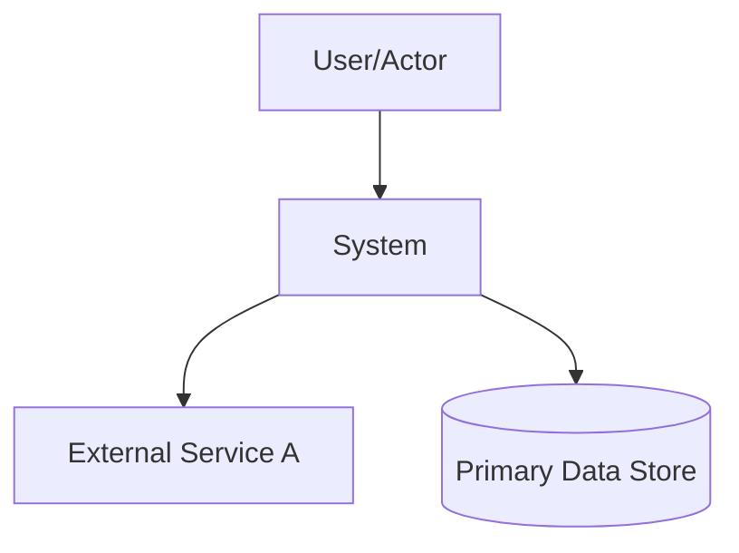

# ARCHITECTURE.md

## Purpose
Describe stable architecture so contributors and agents can quickly locate responsibilities, constraints, and validation paths.

## Bird's-Eye View
- System goal: <one sentence>
- Primary inputs: <events/requests/data>
- Primary outputs: <user-visible behavior>
- Success condition: <what "healthy" means>

## C4 At A Glance

## Boundaries
- In scope: <owned capabilities>
- Out of scope: <external/non-owned concerns>

## Module Map
| Module | Owns | Owner/Responsibility | API Boundary |
|---|---|---|---|
| `<module-a>` | <responsibility> | <team/role> | yes/no |
| `<module-b>` | <responsibility> | <team/role> | yes/no |

## Dependency Rules
- `<module-a>` may depend on `<module-b>`.
- `<module-b>` must not depend on `<module-a>`.
- <additional rule>

## Forbidden Couplings
| Coupling | Status | Enforcement |
|---|---|---|
| `<a> -> <b>` | forbidden | `tooling` or `policy-only` |

## Core Flows
### Flow: <name>
1. <entry>
2. <major processing step>
3. <result>

### Flow: <name>
1. <entry>
2. <major processing step>
3. <result>

## Architecture Decisions
- ADR index: `<path-to-adrs-or-rfcs>`
- Related decisions:
  - `<adr-or-rfc-link>`

## Verification
- How to verify dependency rules: `<command/test/check>`
- How to verify core flow behavior: `<command/test/check>`
