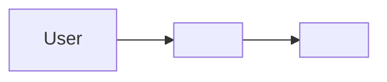
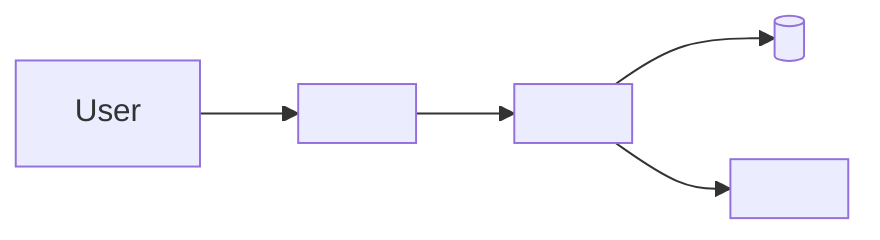
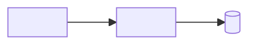

# Architecture: <Project Name>

## Description

<A short paragraph describing what the system is and what you should understand after reading this document.>

## 1. System overview

**Purpose**
- <What problem this system solves.>

**Primary goals**
- <Goal 1>
- <Goal 2>

**Success criteria**
- <How you know it’s working / “done” from a user or operator perspective.>

**Non-goals**
- <Explicitly out of scope.>

## 2. System boundaries

- In scope: <what the system owns>
- Out of scope: <what it depends on / does not own>

## Stack

- Runtime/tooling: <…>
- Language: <…>
- Framework: <…>
- Data/storage: <…>
- Tests: <…>

## Key files and entry points

- `<path>` — <why it matters>
- `<path>` — <why it matters>

## 3. Architectural style

- Style: <Clean/Hexagonal | Layered | Modular monolith | Vertical slice | Event-driven | …>
- Why it fits: <1–3 bullets>
- Tradeoffs: <1–3 bullets>

## 4. Domain model and modules

List the major modules and what they own.

| Module / domain | Owns | Does not own | Key interfaces |
|---|---|---|---|
| <Module A> | <Responsibilities> | <Boundaries> | <APIs/events/files> |
| <Module B> | <Responsibilities> | <Boundaries> | <APIs/events/files> |

## 5. Directory layout

```text
<repo>/
  docs/                      # documentation
  <app>/                     # main app/package
  <shared>/                  # shared utilities (if any)
```

Rules:
- <Where new code must go.>
- <What must not depend on what.>

## 6. Data flow and boundaries

Describe the main “request → work → result” flow(s).

**Key flow: <name>**
- Entry point: `<route>` / `<path>`
- Steps:
  1. <Step>
  2. <Step>
  3. <Step>
- Data touched: <tables/collections/files>
- Failure behavior: <what happens when dependencies fail>

## 7. Cross-cutting concerns

- Authn/authz: <approach>
- Error handling: <approach>
- Logging/observability: <approach>
- Configuration and secrets: <where config lives; how secrets are handled>
- Performance/scaling: <high-level constraints and strategy>

## 8. Data and integrations

**Datastores**
- <DB/queue/object storage> — <what it stores and why>

**External services**
| Service | Purpose | Auth | Failure mode |
|---|---|---|---|
| <Service A> | <Why it exists> | <How we auth> | <What happens if it’s down> |

## 9. Deployment and environments

| Environment | Runtime/hosting | Config differences | Notes |
|---|---|---|---|
| Dev | <…> | <…> | <…> |
| Prod | <…> | <…> | <…> |

Release strategy:
- <How changes ship.>

## 10. Key design decisions

| Decision | Rationale | Tradeoffs |
|---|---|---|
| <…> | <…> | <…> |

## 11. Diagrams (Mermaid)

### C4 L1 — System context



### C4 L2 — Containers



### Core modules (component map)



## 12. Forbidden patterns

Explicit “don’t do this” rules:
- <Anti-pattern 1> — <why it’s harmful>
- <Anti-pattern 2> — <why it’s harmful>

## 13. Open questions

If there are real unknowns that can’t be resolved from the repo, list them:
- <Question> — <why it matters>

## Verification

<Commands/URLs a reader should run/open to confirm this document matches reality, plus what they should see.>
