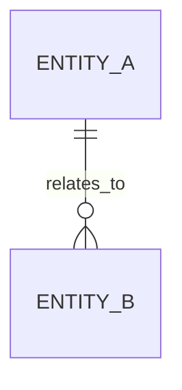

# DB-SCHEMA.md

## Purpose
Human-readable schema digest focused on critical entities and invariants.

## Regeneration Contract
- Schema source mode: `migrations` | `db` | `mixed`
- Generation command/process: `<command-or-process>`
- Generated artifacts (if any): `docs/generated/<artifact>.md`

## ERD (At A Glance)

## Data Classification and PII Boundaries (Optional)
- Classification policy: <link-or-summary>
- PII-bearing entities: <list>
- Logging restrictions: 

## Core Entities
| Entity | Purpose | Owner |
|---|---|---|
| `<entity>` | 
 | <team/role> |

## Critical Constraints
- <constraint>
- <constraint>

## Critical Invariants (5-10)
- <testable invariant>
- <testable invariant>

## Verification
- Validate schema invariants: `<command/test/check>`
