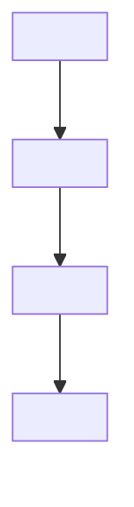

# Feature Walkthrough: <Feature Name>

<One paragraph: what the feature does and why it exists.>

## Scope

- Includes: <what this walkthrough covers>
- Excludes: <what it does not cover>

## User story

<What the user is trying to do.>

## Entry points

- UI: `<route>` (`<path>`)
- API: `<route>` (`<path>`)
- Jobs/CLI (if any): `<cmd>` (`<path>`)

## Flow diagram



## Happy path

1. <Step 1> (`<path>`)
2. <Step 2> (`<path>`)
3. <Step 3> (`<path>`)

## Flow details

| Step | Where | What happens | Notes |
|---|---|---|---|
| 1 | `<path>` / `<route>` | <…> | <…> |
| 2 | `<path>` / `<route>` | <…> | <…> |

## Data and integrations

- Storage touched: <tables/collections/files>
- External services: <APIs>
- Key data transformations: <inputs → outputs>

## Errors and edge cases

- <Edge case> → <what happens>
- <Failure mode> → <what happens>

## Verification

```bash
<commands to run>
```

<What you should see.>
